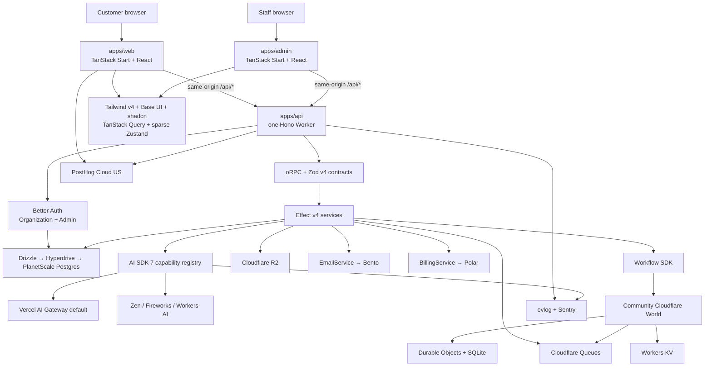
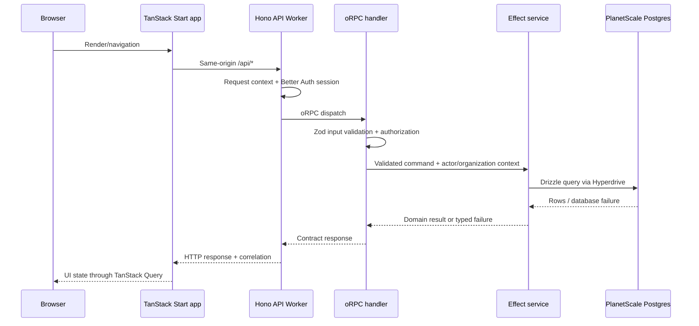

# Architecture overview

## Executive summary

One repository contains one business product as a private pnpm/Turborepo monorepo. The customer experience (`apps/web`) and staff operations console (`apps/admin`) are separate React/TanStack Start applications. All actual backend behavior lives in one Hono Cloudflare Worker (`apps/api`): Better Auth, oRPC/OpenAPI, webhooks, workflow triggers, queue consumers, and scheduled entrypoints. Both frontend origins route same-origin `/api/*` traffic to that Worker.

Zod v4 defines external contracts. Hono/oRPC handlers translate validated requests into Effect v4 programs; Effect is the backend execution/composition model for use cases, repositories, provider adapters, workflows, queues, cron, and configuration. Drizzle owns SQL access and release-coupled migrations for PlanetScale Postgres, reached through Hyperdrive where appropriate. Search stays in Postgres.

Durable, multi-step work uses Workflow SDK inside the Hono backend. Its execution backend is the community `@fantasticfour/world-cloudflare` World, which maps workflow state and delivery onto Durable Objects with SQLite, Cloudflare Queues, KV, and WebSockets. Queues remain buffering/fan-out primitives rather than a second workflow engine. Files live in R2; Postgres holds ownership/metadata. Bento sends React Email templates.

AI features use AI SDK 7 and AI Elements. Features request named capability tiers from a model registry rather than importing providers or hardcoding model names. Vercel AI Gateway is the default route, while Zen, Fireworks, and Workers AI remain direct options. Sentry handles errors, traces, logs, releases, and AI observability; evlog is the logging API; `vitest-evals` keeps AI quality checks in the repository. PostHog Cloud US separately owns product analytics and selective masked replay.

Alchemy provisions and deploys Cloudflare/PlanetScale resources. GitHub Actions is the CI control plane, Depot supplies managed runner compute, and Alchemy stages create PR previews and immutable production versions. Every validated merge to `main` deploys. Green versions receive zero customer traffic while production-targeted synthetic tests run, then normally cut to 100 percent. Changelogen creates reviewable human SemVer/changelog checkpoints without publishing packages.

Polar is Merchant of Record and billing engine; the application preserves its own product entitlement and usage boundary. Better Auth's Organization plugin makes organizations—the UI calls them Teams—the mandatory product tenant. Users may belong to several organizations, but no product data belongs to an individual identity. Better Auth's Admin plugin anchors staff roles and impersonation, while the application owns capability policy, reauthentication, masking, and an append-only Postgres admin audit ledger.

A committed typed capability manifest keeps optional infrastructure absent until a feature needs it. Effect service requirements, CI policy, and Alchemy plans must agree. Predictable application security defaults are instantiated immediately; product-specific abuse controls and a configurable release-readiness profile are completed before production. Cloud preview stages are opt-in and, when enabled, start from an isolated migrated/seeded database with a future sanitized-snapshot path.

## System map

## Locked decision ledger

| Concern | Default | Important qualifier |
| --- | --- | --- |
| Repository | One business product per private pnpm/Turbo monorepo | Apps deploy independently; packages are not published |
| Customer UI | React + TanStack Start on Cloudflare | Frontend/SSR shell, not a backend domain host |
| Staff UI | Separate staff-only TanStack Start app | Same Hono API; capability-gated at every server boundary |
| Styling/components | Tailwind v4 + Base UI + shadcn | Source-owned components; preserve primitive semantics |
| Client data | TanStack Query | Do not mirror server state into Zustand |
| Client-only state | Zustand, sparingly | Only genuinely shared ephemeral browser state |
| Backend | One Hono Cloudflare Worker | Owns all backend HTTP, auth, workflows, queues, and cron |
| API | oRPC on Hono | Public consumers receive conventional OpenAPI-described HTTP |
| External schemas | Zod v4 | Effect Schema does not replace it by default |
| Domain/server model | Effect v4 throughout `apps/api` | Hono/oRPC/Workflow SDK/Zod/Drizzle retain their selected ownership |
| SQL/data access | Drizzle | SQL and migrations remain portable |
| Primary database/search | PlanetScale Postgres | Search remains in Postgres until proven insufficient |
| Auth and tenancy | Better Auth Organization plugin | Organization is the mandatory Team tenant; users may have multiple memberships |
| Staff administration | Better Auth Admin + product capability layer | Application audit ledger is authoritative |
| Durable work | Workflow SDK in `apps/api` | Hono is primary trigger; community Cloudflare World underneath |
| Messaging | Cloudflare Queues | Buffer/fan-out/backpressure, not orchestration |
| Files | R2 | Postgres owns metadata and access decisions |
| Email | Bento + React Email | Templates remain source-owned and provider-neutral |
| AI | AI SDK 7 + AI Elements | Features choose capability IDs, not models |
| AI routing | Vercel AI Gateway default | Direct Zen, Fireworks, and Workers AI are allowed |
| Operational observability | Sentry + evlog | Separate from product analytics and durable audit |
| Product analytics | PostHog Cloud US | Typed semantic events; flags disabled; replay masked/selective |
| AI evals | Vitest + vitest-evals | No hosted eval platform by default |
| Feature flags | Custom OpenFeature-compatible system | PlanetScale authoring, KV snapshots, strong kill-switch path |
| Billing | Polar | MoR + subscriptions + usage + credits; app owns product semantics |
| Tests | Vitest + Playwright + Cloudflare/oRPC integrations | Real matching Postgres; production-targeted smoke after CI/previews |
| IaC/deploy | Alchemy | Sole deployed resource and secret-binding authority |
| CI compute | GitHub Actions + Depot | Ordinary Actions YAML remains portable |
| Preview environments | Opt-in Alchemy stages | Isolated migrated/seeded database by default; sanitized snapshots are a later source |
| Release identity | Every validated `main` merge by Git SHA | Changelogen adds reviewed human SemVer milestones |
| Production rollout | Green at 0%, targeted smoke, normally cut to 100% | Canary ramp is optional for high-risk releases |
| i18n | Paraglide JS | Messages in Git; AI-assisted translations; URL locale first |
| Toolchain | TypeScript 7 + type-aware Oxlint + Oxfmt | `oxlint-tsgolint`; pin/migrate compatibility deliberately |
| Generators | Native `turbo gen`; Giget for a new repo | Vertical feature slices by default |
| Caching | Query + Effect Cache + Cloudflare Cache/KV by semantics | No Redis or universal cache package initially |
| Capability activation | Typed manifest + Effect requirements + Alchemy | Optional infrastructure remains absent until explicitly selected |
| Security/abuse | Instantiated baseline + product threat model | Predictable controls are built in; provider/product-specific controls complete before launch |
| Team identity | Mutable name + stable slug + immutable Team code | Optional DNS badge proves domain control, not business trustworthiness |

## Request path

TanStack Start may render on the server, but it does not contain database/provider/domain logic. The Hono handler is intentionally thin: resolve identity/request metadata, validate, authorize, invoke one use case, and map declared failures.

## State ownership

| State | Authoritative owner | Derived/cache copies |
| --- | --- | --- |
| Users, sessions, organizations, memberships | Better Auth tables in PlanetScale | Cookie/session active-organization state where explicitly configured |
| Organization-owned product identity | Better Auth organization ID + application Team code/domain records | Name/slug/verified-domain presentation |
| Staff capabilities/support sessions | Better Auth + application policy | Admin UI state only |
| Admin action history | Append-only PlanetScale audit ledger | Sentry/evlog correlation and provider logs |
| Product records/search | PlanetScale Postgres | TanStack Query, Effect Cache, approved HTTP cache |
| Files | R2 bytes + PlanetScale metadata | CDN/browser caches |
| Workflow execution | Cloudflare World | Workflow indexes/streaming state in its primitives |
| Queue delivery | Cloudflare Queues | Consumer-local processing state only |
| Feature definitions | PlanetScale | Published KV snapshot |
| Emergency kill switch | Strongly consistent operational path | Optional bounded local read optimization |
| Billing commerce | Polar | Local webhook ledger and entitlement projection |
| Product authorization | Application policy/entitlement service | Derived local projection, never analytics/flags |
| AI model policy | Versioned application configuration | KV/provider/gateway caches where approved |
| Product events/replay | PostHog | Typed local/test adapters |
| Operational telemetry | Sentry + evlog | Provider-native diagnostics/deep links |
| Translations | Git-tracked message files | Generated Paraglide modules |

## Repository boundary

The initial shared packages are `contracts`, `ui`, `i18n`, `observability`, `analytics`, `testkit`, and `typescript-config`. Backend feature modules stay inside `apps/api` until a second real runtime consumer justifies extraction. Apps never import other apps. Packages expose direct TypeScript source and are not published. A root `product.config.ts` declares selected structural capabilities without containing secrets.

See [Monorepo, toolchain, and local development](19-monorepo-toolchain-and-local-development.md) for the complete layout.

## Release boundary

A pull request is the full change set, including migrations and safe flag defaults. CI and an isolated Alchemy preview validate it. Production applies its tied migration, uploads immutable green versions with zero traffic, targets green with synthetic production tests, then cuts traffic. Rollback restores recorded blue versions and applies a tested down migration only while its data-safety contract permits.

See [Release management](22-release-management.md) for migration classifications and the non-atomic data boundary.

## Architecture risks to accept consciously

- TanStack Start is modern and moving; keep framework-specific logic near routes and frontend adapters.
- Effect v4 and Alchemy evolve quickly. Pin compatible versions and keep Zod/oRPC/domain ports as migration boundaries.
- TypeScript 7 is the stable native compiler baseline. Type-aware Oxlint coverage/integrated diagnostics continue to mature; use bounded projects and explicit compatibility gates.
- The Cloudflare Workflow SDK World is community-maintained and young. Pin exact versions, run conformance/recovery tests, and preserve the World boundary.
- Cloudflare KV is eventually consistent. Normal snapshots are not immediate kill switches or authorization/billing state.
- Blue/green application versions share production data; database downgrade is conditional on the migration and observed writes.
- Polar, Bento, Vercel AI Gateway, Depot, Sentry, PostHog, and PlanetScale are managed dependencies. Each is isolated behind an application boundary or standard protocol.

## Deliberately deferred

Realtime collaboration/presence, push/SMS notifications, mobile/desktop architecture, dependency-update automation, full operational-runbook infrastructure, and package/public SDK publishing remain outside the default exercise. Distributed WAF/bot/abuse controls remain product-specific on top of the instantiated security baseline. General caching is intentionally minimal until measured need appears.

## Primary references

- [TanStack Start overview](https://tanstack.com/start/latest/docs/framework/react/overview)
- [oRPC Hono adapter](https://orpc.dev/docs/adapters/hono)
- [Hono](https://hono.dev/docs)
- [PlanetScale Postgres with Cloudflare Workers](https://planetscale.com/docs/postgres/tutorials/planetscale-postgres-cloudflare-workers)
- [Workflow SDK](https://workflow-sdk.dev/)
- [Alchemy gradual deployments](https://alchemy.run/cloudflare/compute/gradual-deployments/)
- [Better Auth Admin plugin](https://better-auth.com/docs/plugins/admin)
- [Better Auth Organization plugin](https://better-auth.com/docs/plugins/organization)
- [PostHog product analytics](https://posthog.com/docs/product-analytics)
