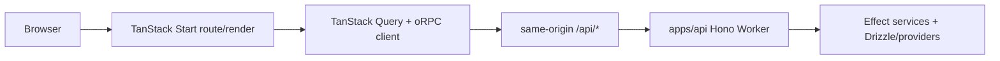

# Frontend architecture

## Default

The repository contains two frontend products:

- `apps/web`: the customer-facing React/TanStack Start application.
- `apps/admin`: the staff-only React/TanStack Start operations console.

Both use Tailwind CSS v4, Base UI accessible headless primitives, source-owned shadcn-style components, TanStack Query for remote state, and Zustand only for shared browser state that is neither URL state nor server state. They call one Hono backend through same-origin `/api/*` routes.

TanStack Start owns routing, rendering, loaders, frontend middleware, SSR/streaming, static assets, and frontend delivery. It is not an alternate domain backend: database access, provider SDK calls, Better Auth handlers, workflows, queues, and business mutations live in `apps/api`.

## Responsibility split

| Need | Owner | Avoid |
| --- | --- | --- |
| Route identity, params, search params, loaders | TanStack Router/Start | Parallel routing state in Zustand |
| Backend reads/mutations | Hono/oRPC client + TanStack Query | Database/provider code in Start routes |
| Request-independent UI state | Local React state | A global store for every toggle |
| Shared ephemeral browser state | Zustand | Copying Query results into a store |
| Styling and tokens | Tailwind v4 + CSS custom properties | Component-local magic colors |
| Accessible interactions | Base UI primitives | Reimplementing focus/dismissal/keyboard behavior |
| Reusable composed UI | Source-owned shadcn-style components | Treating copied code as immutable vendor code |
| AI interaction UI | AI Elements + AI SDK UI | A second chat framework by default |
| Product analytics | Typed `packages/analytics` adapter | Direct PostHog calls throughout components |

## Frontend/backend boundary



Start server code may perform frontend composition work such as rendering, response headers, localized route handling, or safely prefetching the Hono API. It does not import Drizzle schema, provider SDKs, Hono modules, secrets, or Cloudflare backend bindings.

Server-side rendering calls the same application API contract as the browser using forwarded request context/cookies through a deliberate internal adapter. Avoid a second privileged data path that behaves differently from client navigation.

## Rendering and data flow

Use SSR/streaming when it improves first paint, SEO, or navigation. Use client rendering for authenticated application surfaces where SSR offers little. Do not force every route into one rendering style.

For a typical page:

1. The route owns URL parsing, locale, and coarse data dependencies.
2. Query options live near the feature API client rather than inside JSX.
3. The oRPC client calls `/api/*` and receives contract outputs/errors.
4. Components render explicit loading, empty, error, stale, pending, and success states.
5. Mutations update/invalidate Query data; they do not create a second server-state store.
6. Navigation-significant state lives in typed URL search params.

## Feature boundaries

A normal customer feature can contain:

```text
apps/web/src/features/projects/
  api/          # oRPC client helpers and query options
  components/   # customer-specific UI
  state/        # Zustand only if justified
  model/        # browser-safe types and formatters
  routes/       # route composition
```

The admin application mirrors this shape for operational features but does not import customer app files. Truly shared UI belongs in `packages/ui`; shared contracts in `packages/contracts`; translations in `packages/i18n`; typed events in `packages/analytics`.

A generic `Button` is shared. `CustomerPlanBadge` remains feature-owned until both apps need the same semantics and presentation.

## Base UI and shadcn

Base UI owns interaction/accessibility semantics. The shadcn approach means the repository owns composed source and can adapt it deliberately.

Rules:

- Preserve roles, labels, focus transitions, dismissal, and keyboard behavior.
- Wrap repeated composition in stable components rather than duplicating utility-class walls.
- Keep design tokens in CSS variables and Tailwind theme configuration.
- Prefer product intent variants such as `intent="danger"` over raw color switches.
- Test portals, dialogs, menus, comboboxes, focus traps, reduced motion, and responsive layout in Chromium through Playwright.
- Share primitives/tokens across web and admin without forcing identical product navigation or information density.

## TanStack Query conventions

- Define stable keys from normalized identifiers, organization, and relevant representation inputs.
- Server authorization remains mandatory even when a query is conditionally disabled.
- Set stale times by data class rather than one global default.
- Do not retry validation, authorization, or deterministic domain failures.
- Mutations are idempotent where users/networks can repeat them.
- Hydration is an optimization; correctness cannot depend on preloaded state.
- Optimistic updates require a clear rollback; otherwise use pending UI and invalidation.
- Clear or partition organization-scoped caches when identity/membership changes.

See [Caching](23-caching.md) for the full cache consistency model.

## Zustand conventions

Valid uses include a cross-route editor draft, transient multi-panel layout, command palette, or complex local interaction state machine. Invalid uses include sessions, entitlements, project records, query results, feature flags, or locale.

Create small feature-owned stores with selectors and colocated actions. Avoid one application-wide store, middleware stacks by default, or persistence unless the product explicitly wants browser-restart survival.

## Admin-specific frontend rules

Customer routes use `/t/:organizationSlug/*`; Better Auth active-organization state is a navigation convenience, while Hono verifies membership for the URL organization. `apps/admin` renders only after the Hono API confirms staff access. Sensitive fields are masked by default. Recent-reauth and reason requirements come from server responses/policy, not client conditionals. Impersonation always shows an unmissable banner containing real actor, effective user, target organization, expiry, restrictions, and exit action.

See [Admin and support](20-admin-and-support.md).

See [Team tenancy and identity](26-team-tenancy-and-identity.md) for switching, URL, cache, and invitation rules.

## Analytics and privacy

Use the typed analytics adapter for named semantic events. Pageviews/basic navigation may be automatic; important success events come from the authoritative Hono transition. Sensitive DOM regions suppress PostHog replay. Staff/admin sessions are excluded from customer analytics.

## Accessibility and performance

- Keyboard navigation, focus visibility, reduced motion, semantics, contrast, and error announcements are acceptance criteria.
- Prefer CSS/platform primitives before client JavaScript.
- Use route-level splitting and keep server-only libraries outside client-safe packages.
- Measure bundle/runtime cost before introducing editors or additional component frameworks.
- React Compiler may reduce manual memoization pressure once verified against the dependency set; rendering must remain pure without it.

## What not to do

- Do not put actual backend/domain code in TanStack Start server functions.
- Do not let `apps/web` and `apps/admin` import one another.
- Do not introduce TanStack DB or Zero before a proven reactive/local-first need.
- Do not make Zustand authoritative for authenticated server data.
- Do not bypass Base UI behavior with fragile DOM manipulation.
- Do not call PostHog directly throughout UI code.
- Do not make AI Elements an authorization or domain-decision layer.

## Escape hatches

- TanStack Query can later feed TanStack DB if reactive local collections become justified.
- A chat-first product can adopt assistant-ui if its thread/runtime abstractions materially reduce product code.
- Tailwind, Base UI, or individual source-owned components can be replaced incrementally behind stable component APIs.
- Either frontend can move to another React/Vite host while preserving oRPC contracts and backend boundaries.

## Primary references

- [TanStack Start](https://tanstack.com/start/latest/docs/framework/react/overview)
- [TanStack Query](https://tanstack.com/query/latest/docs/framework/react/overview)
- [Tailwind CSS v4](https://tailwindcss.com/blog/tailwindcss-v4)
- [Base UI](https://base-ui.com/react/overview/quick-start)
- [shadcn](https://ui.shadcn.com/docs)
- [Zustand](https://zustand.docs.pmnd.rs/)
- [AI Elements](https://ai-sdk.dev/elements/overview)
