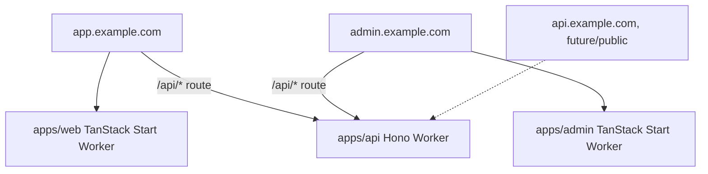
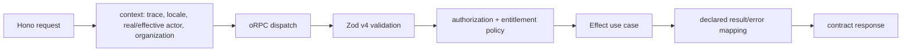

# Backend and API architecture

## Default shape

`apps/api` is the one backend application: a Hono Cloudflare Worker. It owns all backend HTTP concerns, including oRPC/OpenAPI, Better Auth, provider webhooks, streaming endpoints, workflow starts/signals, Cloudflare Queue consumers, and scheduled entrypoints.

TanStack Start owns the customer/admin frontend shells and SSR. It does not provide a parallel backend implementation. The normal request path is:

```text
TanStack app or browser → same-origin /api/* → Hono → oRPC → Effect → adapters
```

This adds no redundant application layer: Hono is the backend runtime/router, oRPC owns typed application contracts, Zod owns boundary validation, and Effect owns domain/server execution semantics.

## Deployment and routing



In production, Alchemy/Cloudflare routes each frontend origin's `/api/*` directly to the same API Worker. Locally, Vite/dev proxies preserve the same path and cookie behavior. A dedicated `api.example.com` hostname is reserved for public or cross-origin consumers rather than required for first-party apps.

## Internal layout

```text
apps/api/src/
  index.ts                 # Hono composition and Worker entrypoints
  http/
    context.ts             # normalized actor, organization/member, locale, correlation
    orpc.ts                # oRPC adapter/routers
    auth.ts                # Better Auth mount
    webhooks/              # raw-body verification and durable acceptance
    streaming/             # SSE/AI streaming adapters
  modules/
    auth/
    billing/
    files/
    ai/
    email/
    flags/
    ...                    # product vertical modules
  workflows/               # Workflow SDK definitions/triggers
  steps/                   # reusable idempotent durable steps
  queues/                  # Queue consumers and DLQ/replay handling
  scheduled/               # cron handlers
  platform/                # Drizzle, R2, providers, runtime bindings
```

There is no `apps/workflows` by default. Workflows are a backend capability, not another customer-facing product or independently operated service.

## Worker entrypoints

The same deployment exposes the runtime entrypoints Cloudflare requires:

- `fetch`: Hono HTTP router;
- queue consumers: Cloudflare Queue batch handlers;
- scheduled: cron dispatch into typed use cases/workflow triggers;
- Workflow World/Durable Object exports and bindings required by the selected community implementation.

Entrypoints immediately create typed request/operation context and invoke shared use cases. Queue or cron code does not call Hono over HTTP merely to reuse business logic.

## API surfaces

| Surface | Mechanism | Audience |
| --- | --- | --- |
| First-party app API | oRPC handler mounted in Hono | web/admin clients and SSR adapters |
| Public HTTP API | oRPC OpenAPI handler mounted in Hono | external clients/generated SDKs |
| Authentication | Better Auth Hono route | browsers and identity clients |
| Provider webhooks | focused Hono routes | Polar/Bento/other providers |
| Streaming/SSE | Hono route using AI SDK/oRPC where appropriate | first-party or public clients |
| Internal Worker binding | narrow Fetch/RPC contract | Cloudflare-internal callers only |
| Workflow/queue/cron | native Worker entrypoints calling use cases | infrastructure runtime |

Public consumers do not need to know the implementation uses RPC. Publish conventional paths, verbs, statuses, auth, idempotency, and OpenAPI. The first-party apps use the richer oRPC client and TanStack Query integration against the same contract.

No SDK/package publishing is required initially. If a public API later needs generated clients, produce them deliberately as release artifacts or a separate decision.

## Procedure flow



An oRPC handler should normally:

1. Accept contract-validated input.
2. Resolve actor, effective user, URL organization/membership, locale, trace, release, and idempotency metadata.
3. Authorize the action on the resource.
4. Call one Effect application/domain operation.
5. Map typed failures to declared safe API errors.
6. Return only contract output.

SQL, provider SDK calls, workflow step bodies, retry loops, or plan conditionals inside a transport handler indicate a leaking boundary.

## Hono middleware

Use a short, explicit middleware chain for concerns that truly apply to transport:

- request/release/correlation IDs and Sentry/evlog context;
- instantiated trusted-origin/CORS/CSRF baseline plus product overrides;
- Better Auth session resolution without confusing it with authorization;
- body/time limits and safe content-type handling;
- consistent response/error envelopes and security headers;
- production test/synthetic-organization markings.

Domain authorization, billing policy, retries, and provider behavior remain inside use cases/services. Do not hide product rules inside global middleware ordering.

## Request context

The exact type can evolve, but it must distinguish real and effective actors:

```ts
type RequestContext = {
  requestId: string
  traceId?: string
  releaseId: string
  actor: { type: 'user'; userId: string } | { type: 'apiKey'; keyId: string } | { type: 'system' }
  effectiveUserId?: string
  organizationId?: string
  memberId?: string
  organizationRoles?: ReadonlySet<string>
  staffCapabilities?: ReadonlySet<string>
  locale: string
  idempotencyKey?: string
  syntheticProductionTest?: boolean
}
```

Impersonation never overwrites the real actor. Audit, policy, observability, and provider actions can always answer who initiated an operation and on whose behalf it ran.

The URL organization and Better Auth membership produce trusted organization context. Session `activeOrganizationId`, a client payload, Team name/slug alone, or email domain never grants scope. See [Team tenancy and identity](26-team-tenancy-and-identity.md).

## Contract design

- Use Zod v4 for inputs, outputs, path/query/header fields where meaningful, and structured errors.
- Never return raw Drizzle rows or Better Auth/Polar/provider objects.
- Prefer product vocabulary over implementation/provider names.
- Add public fields compatibly; version semantic changes deliberately.
- Use opaque cursors when ordering can change.
- Require explicit idempotency for repeatable external mutations.
- Generate/validate OpenAPI in CI when a public API is promised.
- Include durable schema versions for messages/workflow inputs rather than coupling them to current TypeScript types.

## Webhooks

Every inbound webhook:

- reads the raw body when signature verification requires it;
- verifies signature/timestamp before trusting parsed fields;
- records the provider event ID in a unique ledger;
- acknowledges duplicates safely;
- durably accepts work and returns quickly;
- starts a workflow for multi-step behavior;
- correlates provider event, operation, audit, workflow, and release IDs.

Outbound webhooks use signed versioned payloads, destination secrets, stable event IDs, retry/backoff, delivery history, and disable/replay controls. Workflow SDK owns durable delivery; Queues may buffer fan-out.

## Streaming and disconnects

Use AI SDK streaming and Hono/oRPC streaming adapters. Define cancellation, disconnect, partial result, billing, and resume semantics. Browser disconnect may interrupt request-scoped work, but never silently cancels accepted durable/billable operations. Those return an operation ID and continue through Workflow SDK.

## What not to do

- Do not implement backend domain behavior in either TanStack Start app.
- Do not split workflows into another app without independent scaling/ownership evidence.
- Do not expose database/provider models as API models.
- Do not throw undifferentiated `Error` for expected product failures.
- Do not publish the internal RPC wire format as the public API.
- Do not hide resource authorization inside global middleware.
- Do not retry non-idempotent mutations without an idempotency contract.
- Do not have queue/cron consumers call the public API to reach local use cases.

## Escape hatches

- A public API can later become a second Hono Worker while reusing Zod contracts and domain services.
- The same application can split queue/workflow execution after real operational isolation needs appear.
- oRPC OpenAPI supports conventional clients; first-party apps can retain typed RPC.
- If oRPC becomes unsuitable, Hono, Zod contracts, and the thin handler/domain boundary bound the migration.

## Primary references

- [Hono](https://hono.dev/docs)
- [oRPC](https://orpc.dev/)
- [oRPC Hono adapter](https://orpc.dev/docs/adapters/hono)
- [oRPC OpenAPI](https://orpc.dev/docs/openapi/openapi-handler)
- [Better Auth Hono integration](https://better-auth.com/docs/integrations/hono)
- [Cloudflare Workers handlers](https://developers.cloudflare.com/workers/runtime-apis/handlers/)
