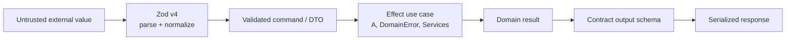

# Validation and Effect usage

## Core decision

Use Zod v4 as the external schema and contract language. Use Effect v4 throughout the Hono backend for use cases, repositories, provider/platform services, typed failures, dependency wiring, concurrency, retries, timeouts, interruption, resource safety, configuration, and tracing.

Do not standardize on Effect Schema for public API contracts while oRPC/Zod remains the selected boundary. Do not pull Effect into ordinary React components merely to make the stack feel consistent.

## Boundary model

Zod answers: “Is this external value structurally valid, and what normalized DTO enters the application?” Effect answers: “What can this operation require, fail with, retry, interrupt, or acquire while implementing the product behavior?”

## Zod v4 conventions

- Parse every trust boundary: HTTP, webhook payloads, environment values exposed outside Effect Config, queue messages, workflow inputs, AI structured output, and persisted JSON blobs.
- Keep schemas close to the contract that owns them. Export inferred DTO types rather than duplicating interfaces.
- Separate create, update, public response, and database shapes when their semantics differ.
- Use transformations only for cheap, deterministic normalization. Domain lookups and authorization are not schema refinements.
- Prefer explicit unknown-field policy. Public write contracts should not silently accept fields the server ignores when that could mask client bugs.
- Attach stable machine-readable error codes at the API layer; validation messages are for developers or localized UI mapping, not a long-term public protocol by themselves.
- Version durable queue/workflow payloads so a deployed consumer can recognize older producers.

## Effect v4's role

Effect is the backend execution and composition model. Hono/oRPC handlers, repositories, Workflow SDK steps, queue/cron entrypoints, and provider adapters invoke or implement Effects. Typical services include:

- `Database` or repository implementations over Drizzle;
- `EmailService` with a Bento adapter;
- `BillingService` with a Polar adapter;
- `EntitlementService` that implements product policy;
- `ObjectStore` with an R2 adapter;
- `JobQueue` with a Cloudflare Queues adapter when the capability is selected;
- `DurableWorkflow`/Workflow SDK trigger and status adapters;
- `FeatureFlags` with the custom OpenFeature-compatible provider;
- `ModelPolicy` or `AIService` over the AI SDK registry;
- `AdminAudit` for the append-only staff action ledger;
- `ProductAnalytics` for typed best-effort server outcome events;
- module-owned Effect `Cache` instances for bounded isolate-local lookup deduplication where measured;
- clock, ID generator, crypto, and request context.
- organization context/membership policy derived from Better Auth.

A use case declares only the capabilities it needs. Layers wire production adapters at the application edge and deterministic fakes/in-memory adapters in tests. A selected backend module must be fully provided before the single edge runner executes it; do not call `Effect.runPromise` inside feature code to hide unmet requirements.

## Error taxonomy

| Error class | Example | Treatment |
| --- | --- | --- |
| Validation | malformed email, invalid cursor | Rejected by Zod/contract |
| Authentication | no valid session/API key | Mapped to unauthenticated response |
| Authorization | actor cannot modify project | Mapped to forbidden or intentionally hidden not-found |
| Domain conflict | seat limit reached, state transition invalid | Typed domain failure with stable code |
| Dependency transient | provider timeout, connection reset | Retry only when safe and bounded |
| Dependency permanent | invalid provider credential | Do not retry; alert/configuration failure |
| Defect | invariant violation, impossible branch | Capture in Sentry; generic external response |

Expected business outcomes stay in Effect's typed error channel. Defects are programming or invariant failures. Do not convert every unknown exception into a fake typed domain error; that destroys the distinction observability needs.

## Retry ownership

There must be one retry owner per failure boundary:

- An Effect service may retry a safe, short transient provider call within a request.
- Workflow SDK retries durable steps and resumes after process/runtime failures.
- Cloudflare Queues retries message delivery and moves exhausted messages to a DLQ.
- A client may retry idempotent reads, not arbitrary mutations.

Nested automatic retries multiply traffic and cost. A workflow step that calls an Effect with three retries and is itself retried five times can execute the provider call fifteen times. Configure the inner and outer policies together and require idempotency for side effects.

## Cancellation and resource safety

Translate request abort signals into Effect interruption for work that should stop when the requester leaves. Do not tie background or billable durable work to the browser connection. Use scoped acquisition/release for resources such as temporary streams, database transactions, and provider clients that need cleanup.

## Configuration

Use Effect Config for server/runtime configuration, especially where Alchemy resolves it into Worker bindings. Use redacted configuration values for secrets and avoid logging raw config. Client-exposed values are a separate, explicitly prefixed and Zod-validated surface.

Structural capability selection is not an environment variable. A committed typed `product.config.ts` says whether a service is absent, configured, or enabled. Effect service requirements and the final Layer composition make missing capabilities a type error where possible; `pnpm capabilities:check` reconciles the manifest, Layers, config contracts, and Alchemy resource plan. See [Capability activation and release readiness](25-capability-activation-and-release-readiness.md).

Compatibility note: Alchemy's Effect Config discovery occurs during its initialization/plan phase; values needed by a deployed Effect-native Worker must be resolved in the outer initialization scope, not discovered only inside a per-request handler.

## Effect containment

Effect should end at clear adapters:

- Hono/oRPC handlers run an Effect and map its result.
- Workflow steps run an Effect and serialize a plain result/failure appropriate for Workflow SDK.
- Queue consumers parse a message, run an Effect, then acknowledge/retry based on the result.
- React receives plain contract results; it does not import Layers or server services.
- TanStack Start server modules call the Hono contract; they do not construct backend Layers.
- One application-edge runner provides the request context and selected production Layers; domain/features never run their own partial service graph.

This containment makes Effect v4 churn survivable and keeps external integrations comprehensible to developers and tools that do not know Effect.

## Compatibility and upgrade policy

Effect v4 is still beta as of this guide. Pin exact beta versions. All Effect ecosystem packages must share compatible versions. Group Effect and Alchemy dependency updates, read both changelogs, and require the full server, worker-runtime, and infrastructure test suites before merging.

Avoid `effect/unstable/*` modules unless they replace meaningful local complexity and the project accepts the migration cost. oRPC, Zod, Drizzle, and Workflow SDK retain ownership of their selected layers instead of being replaced by Effect's unstable alternatives.

## What not to do

- Do not have Zod and Effect Schema validate the same request independently.
- Do not pull Effect into React/browser view formatting merely because the backend uses it fully.
- Do not create a service interface for every function; use services at I/O, policy, time, randomness, and major domain boundaries.
- Do not call `Effect.runPromise` deep inside domain code. Run at the application edge.
- Do not retry validation, authorization, insufficient-credit, or other deterministic failures.
- Do not leak `Cause`, provider errors, or raw SQL errors through API contracts.
- Do not treat Effect Cache as a globally consistent/distributed state store.

## Escape hatches

- If Effect v4 churn becomes too expensive, handlers and contracts remain intact while services can be reimplemented with plain async TypeScript.
- If Effect Schema later becomes materially better for internal serialization, adopt it inside a bounded subsystem without replacing Zod contracts.
- If Alchemy changes config behavior, an explicit adapter can read Worker bindings and provide an Effect ConfigProvider.

## Primary references

- [Zod](https://zod.dev/)
- [Effect](https://effect.website/)
- [Effect v3-to-v4 migration guide](https://github.com/Effect-TS/effect-smol/blob/main/MIGRATION.md)
- [Alchemy secrets and Effect Config](https://v2.alchemy.run/environments/secrets/)
- [Capability activation and release readiness](25-capability-activation-and-release-readiness.md)
