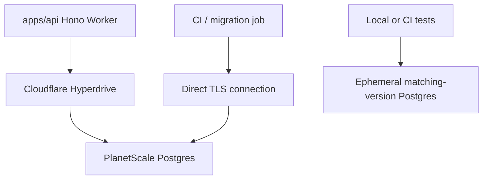
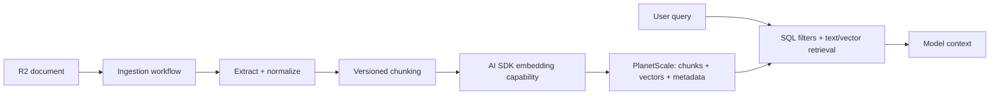

# Data, database, and search

## Default

PlanetScale Postgres is the authoritative application database. Drizzle owns schema definitions, migrations, and typed SQL access. Cloudflare Workers reach PlanetScale through an Alchemy-managed Hyperdrive binding by default for production request traffic. Search remains in Postgres: relational filters and indexes first, PostgreSQL full-text search next, then `pgvector`/`pgvectorscale` for semantic retrieval.

No separate search engine or vector database is part of the default stack.

## Connection paths

Use the path that matches the workload:

- Worker request traffic: Hyperdrive and a standard Postgres driver supported by the integration.
- Administrative migrations: direct connection with a dedicated privileged role.
- Long-lived/session-specific database behavior, if any: a direct connection, not transaction-mode pooling, after proving the need.
- Local and CI integration tests: disposable real Postgres pinned to the production major and ideally minor version.

PlanetScale offers direct connections on port 5432 and PgBouncer on 6432. Hyperdrive supplies its own connection pooling and is configured against the appropriate PlanetScale origin. Do not stack pooling modes without understanding their semantics.

## Drizzle boundaries

- Drizzle schema files are the code representation of database structure.
- Generated SQL migrations are reviewed artifacts and run once per environment.
- Repositories/query modules encapsulate queries that express product concepts.
- Transactions live in the application service that owns the invariant, not in UI/API handlers.
- Raw SQL is allowed when it is clearer or enables a PostgreSQL feature; it must remain parameterized and tested.
- API contracts and domain objects must not depend directly on generated table row types.

Keep SQL close to the feature that owns the data rather than creating one enormous generic repository layer. A repository is useful when it names domain behavior or isolates a complex query; `BaseRepository<T>` abstractions usually hide useful SQL capabilities.

## Release-coupled migrations

Migrations are part of the complete pull-request release, not a separately drifting deployment and never a Worker-startup side effect. The release manifest records the Git SHA, exact migration range, required feature-flag defaults, and one reversibility class:

- **Reversible:** forward and down paths are tested and new writes remain safely representable by the previous schema.
- **Conditionally reversible:** downgrade is safe only until a declared activation or new-write condition occurs.
- **Forward-only:** application code may roll back, but the compatible expanded schema remains.
- **Destructive:** requires a staged transition, verified recovery plan, or explicit maintenance/write boundary.

CI applies forward migrations to matching-version ephemeral Postgres, runs the new application suite, and exercises the down path for migrations that claim reversibility. Production applies the reviewed migration with a dedicated privileged role under a release lock before green code receives traffic. Green then runs targeted production tests against the resulting schema before cutover.

Important rules:

1. A migration must remain compatible with the currently serving blue version during zero-traffic green testing unless the release explicitly uses a maintenance/write boundary.
2. Feature flags can delay behavior activation but cannot make an incompatible schema safe.
3. Large data backfills run as observable Workflow SDK jobs with bounded batches and resumable checkpoints—not inside the DDL transaction, request path, or Alchemy plan.
4. `NOT NULL`, unique, or expensive indexes are added only after data and operational impact are ready.
5. A down migration runs automatically only while its classification and observed production writes still make it data-safe.
6. Restoring a backup is disaster recovery, not routine rollback, because writes after the restore point would be lost.
7. Schema migration credentials remain separate from application credentials.

PlanetScale Postgres branches are isolated deployments and do not continuously replicate production writes or automatically merge schema changes. They are useful for rehearsal or selected previews, not a synchronized green production database and not the normal CI database.

See [Release management](22-release-management.md) for the complete blue/green and rollback sequence.

## Tenancy and authorization

Every product is organization-tenant-first. Include Better Auth `organizationId` ownership on organization-scoped rows and indexes. Every query path establishes organization scope from authenticated membership/resource context, not client input alone. Prefer composite uniqueness constraints that include `organizationId` where business uniqueness is organization-local.

Postgres row-level security was not selected as a platform-wide rule. If a project adopts it, treat it as defense in depth and test it explicitly; application authorization remains required.

## Search progression

### Stage 1: ordinary SQL

Use normalized columns, B-tree indexes, trigram indexes where supported/needed, and well-designed filters/sorts. Many “search” screens are structured queries, not full-text search.

### Stage 2: Postgres full-text search

Use generated/stored search vectors or an explicitly maintained column, language-aware configurations, weighted fields, and GIN indexes. Keep ranking and filters in one SQL query when possible. Track query plans and relevance fixtures.

### Stage 3: semantic retrieval

Use `pgvector` for embeddings and `pgvectorscale` when its filtering/compression/index behavior is justified. Store organization ID, embedding model ID, dimensions, source content hash, chunking version, and creation timestamp. Hybrid retrieval combines organization/security filters, keyword rank, and vector similarity before reranking.

## Data lifecycle

The stack choice does not automatically decide retention. Each project must specify:

- authoritative records and derived/rebuildable records;
- backup/restoration expectations and recovery objectives;
- soft deletion versus hard deletion by entity;
- legal/product retention windows;
- user export/deletion paths;
- audit records that must outlive ordinary product rows;
- R2 object cleanup when metadata is deleted;
- embedding/search-index cleanup and rebuild procedures.

Use an outbox or durable workflow boundary for cross-system changes. A Postgres transaction cannot atomically commit Polar, R2, Bento, or a queue operation. Persist intent/ledger state first, then process side effects idempotently.

See [Team tenancy and identity](26-team-tenancy-and-identity.md) for the canonical organization, membership, naming, and isolation model. The configured production readiness profile supplies recovery/backup/restore/export/deletion decisions before release.

## Performance conventions

- Measure with query plans and PlanetScale insights before caching around bad SQL.
- Select only required columns for hot paths.
- Avoid per-row network loops; batch or join.
- Apply pagination and bounded result sizes to every untrusted list query.
- Treat connection count and transaction duration as explicit resources.
- Use smart placement/region alignment for database-heavy Worker traffic when measurement supports it.

## What not to do

- Do not add Elasticsearch, Typesense, Meilisearch, Pinecone, or Qdrant preemptively.
- Do not use PlanetScale branches for the normal CI test matrix.
- Do not claim a migration is reversible without testing its downgrade and new-write behavior.
- Do not run migrations during Hono Worker startup.
- Do not put file bytes in Postgres or ownership rules only in R2 object names.
- Do not let workflows use the application database as an undocumented execution-state store; the Cloudflare World owns its state.
- Do not use production credentials in previews or CI.
- Do not rely on ORM types as data-retention or authorization policy.

## Escape hatches

- Standard PostgreSQL and Drizzle make migration to another Postgres provider possible.
- Search can be dual-written/backfilled into a dedicated engine when query volume, latency, relevance features, or operational isolation justify it.
- Vector data can be rebuilt from source objects and versioned chunk metadata, so the embedding store is not an irreplaceable primary record.

## Primary references

- [PlanetScale Postgres](https://planetscale.com/docs/postgres)
- [PlanetScale connection methods](https://planetscale.com/docs/postgres/connecting)
- [PlanetScale Postgres with Cloudflare Workers and Hyperdrive](https://planetscale.com/docs/postgres/tutorials/planetscale-postgres-cloudflare-workers)
- [PlanetScale extensions](https://planetscale.com/docs/postgres/extensions)
- [Drizzle ORM](https://orm.drizzle.team/docs/overview)
- [PlanetScale Postgres branching](https://planetscale.com/docs/postgres/branching)
