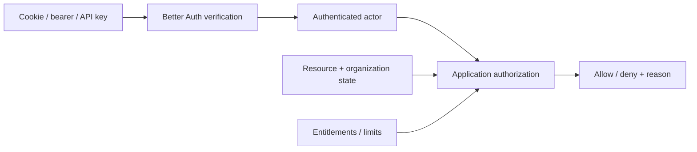

# Authentication architecture

## Default

Better Auth owns authentication and its database-backed identity/session records in PlanetScale Postgres. Its Organization plugin is mandatory: an organization is the product's Team tenant, and a user may hold memberships in several organizations. The application owns resource authorization, product policy, tenant-owned records, verified-domain claims, and the durable administrative audit ledger. Better Auth's Admin plugin is enabled for staff roles/permissions and impersonation; passkey/WebAuthn is preferred for staff, with 2FA and recovery codes as fallback. API-key, SSO, SCIM, nested Better Auth Teams, and other plugins remain need-driven.

Polar integrates with Better Auth for customer association, checkout, portal, usage, and verified webhooks, but authentication and billing identities remain separate concepts.

## Trust boundaries



Better Auth answers “Who or what is making this request?” Application policy answers “May this actor perform this operation on this resource now?” Polar answers billing/commercial questions. None substitutes for the others.

## Integration shape

- Mount Better Auth at one well-known same-origin route in the single Hono API Worker.
- Create server and client auth modules separately.
- Read and verify sessions on the server for private data.
- Pass real actor, effective user, organization/member context, staff capability, and recent-auth context into oRPC/Effect when applicable.
- Keep Better Auth table migrations aligned with the Drizzle/PlanetScale deployment process.
- Route verification, reset, invite, and security messages through the shared `EmailService` so templates and delivery policy remain consistent.
- Configure `nodejs_compat` and any required runtime APIs explicitly for Cloudflare.

TanStack Start applications use the Better Auth client/session surface but do not host auth handlers or import the server configuration. Both frontend origins route auth/API paths to the same Hono Worker so one Better Auth installation and user/session store remain authoritative.

## Session model

Prefer secure, HTTP-only, same-site cookies for the browser application. Use bearer/API keys for programmatic clients only where required. Avoid cross-domain cookies; use subdomains and `SameSite=Lax` where possible. When cross-site cookies are unavoidable, configure `Secure`, `SameSite=None`, origin checks, and CORS deliberately.

Define:

- session duration and renewal behavior;
- revocation after password/email/security changes;
- device/session visibility if the product exposes it;
- step-up authentication for destructive or financial operations;
- session caching rules and their revocation tradeoff;
- audit events for login, failure, credential change, privilege change, and recovery.

## Organizations and tenancy

Better Auth's organization ID is the canonical tenant identity. Product UI calls it a Team; backend/database code uses `organizationId`. There are no personal product tenants. An unaffiliated open signup names an organization and becomes owner; an invited user joins the inviter's organization without receiving a personal Team.

Every organization-owned record carries explicit `organizationId`. The URL identifies the intended organization (`/t/:organizationSlug/*`), Hono resolves membership, and Better Auth's `activeOrganizationId` is a recent-selection convenience rather than the only authorization input. Organization membership changes invalidate or re-evaluate authorization, entitlement, and sensitive cache projections.

Names are mutable and may duplicate. Slugs are globally unique and separately mutable; old slugs are never reassigned across organizations. An immutable random Team code provides a stable human reference. Optional DNS verification proves domain control and is application-owned unless SSO is configured. See [Team tenancy and identity](26-team-tenancy-and-identity.md).

Do not assume every billing customer is a user. An organization may pay for members; enterprise access may be provisioned outside self-serve checkout; support/admin actors may have scoped access; service accounts and API keys are distinct actor types.

## Authorization pattern

Policy functions/services should use product language:

```ts
canEditProject(actor, project)
canInviteMember(actor, organization)
canConsumeCapability(actor, 'ai.chat.premium')
```

They should not check UI route names, raw subscription statuses, or Better Auth plugin internals. Centralize role/permission vocabulary, but avoid one giant generic ACL engine before product needs justify it.

## Account lifecycle

Sign-up, email verification, invitations, password reset, account deletion, organization removal, and billing-customer creation are multi-system operations. Define the source-of-truth transition and make secondary effects idempotent.

Example open sign-up flow:

1. Better Auth creates the user/session transactionally.
2. If the user has a pending invitation, require the intended verified email and join that organization.
3. Otherwise require the unaffiliated user to name an organization and create an owner membership.
4. A durable post-organization workflow creates only selected Polar/Bento/analytics/default associations and sends onboarding messages.
5. Failures are retried without creating duplicate customer records, memberships, or emails.
6. The organization can use core non-billing functionality even if a nonessential integration is temporarily delayed.

## Staff identity and support sessions

Staff are privileged users in the same Better Auth identity system, not a second user database. Role presets such as support, operations, and owner bundle application capabilities; Hono authorizes capabilities rather than scattered role strings.

Staff authentication requires passkey/WebAuthn where possible and MFA/recovery fallback. Recent reauthentication is required before impersonation, role changes, credential/session resets, sensitive data reveal, financial adjustments, or destructive operations.

Better Auth Admin supplies the impersonation primitive and `session.impersonatedBy`. The application wraps it in an audited support session:

- reason required before start;
- maximum duration 30 minutes;
- staff targets cannot be impersonated;
- real actor and effective user remain distinct in request context;
- sensitive/destructive capabilities are blocked or separately authorized;
- the admin UI displays a persistent banner and immediate exit action;
- start, stop, expiry, action, and result are appended to the Postgres audit ledger.

See [Admin and support operations](20-admin-and-support.md) for the capability/risk model and audit fields.

## Security status

Every instantiation receives the standard application security preset: trusted-origin/CSRF handling, secure cookies, response headers/CSP baseline, bounded bodies, safe errors/redaction, and throttling interfaces for login/recovery/verification/invitations. Configure Better Auth with strict verified-email invitation acceptance and opaque expiring invitation IDs. Product-specific WAF, bot, distributed quota, credential-stuffing, and broader abuse controls remain part of the pre-launch threat model. See [Capability activation and release readiness](25-capability-activation-and-release-readiness.md).

At minimum, review per project:

- trusted origins and CSRF protection;
- login/recovery/invite rate limits;
- session and cookie settings;
- OAuth redirect allowlists and state/PKCE behavior;
- email enumeration behavior;
- API key storage, display-once behavior, hashing, scopes, and rotation;
- customer auth abuse controls and staff/support-session monitoring;
- passkey/MFA/SSO requirements for each actor class;
- deletion/export obligations.

## What not to do

- Do not treat `session !== null` as authorization.
- Do not put raw provider tokens in browser storage.
- Do not create a parallel user table that drifts from Better Auth without an explicit mapping reason.
- Do not create personal product tenants or a parallel organization/membership system.
- Do not use an email domain, mutable Team name, slug alone, or client-supplied organization ID as authorization.
- Do not automatically create external billing/email records inside a fragile request transaction.
- Do not scatter role strings and subscription checks through routes/components.
- Do not enable many plugins preemptively; each expands schema, surface area, and security review.
- Do not collapse the real operator into the impersonated user in logs, policy, or audit.
- Do not treat Sentry/evlog as the authoritative admin audit ledger.

## Escape hatches

- Identity ownership in Postgres makes migration from Better Auth possible, although passwords/credentials require careful provider-specific migration.
- OIDC/SAML/SCIM plugins can be introduced for enterprise needs without changing resource authorization.
- A managed identity provider can later sit behind the actor normalization boundary if operational requirements outweigh ownership preferences.

## Primary references

- [Better Auth](https://better-auth.com/docs)
- [Better Auth basic usage](https://better-auth.com/docs/basic-usage)
- [Better Auth plugins](https://better-auth.com/docs/plugins)
- [Better Auth with Hono](https://better-auth.com/docs/integrations/hono)
- [Better Auth Polar plugin](https://better-auth.com/docs/plugins/polar)
- [Better Auth Admin plugin](https://better-auth.com/docs/plugins/admin)
- [Better Auth Organization plugin](https://better-auth.com/docs/plugins/organization)
- [Better Auth SSO domain verification](https://better-auth.com/docs/plugins/sso)
- [Better Auth passkey plugin](https://better-auth.com/docs/plugins/passkey)
- [Better Auth two-factor authentication](https://better-auth.com/docs/plugins/2fa)
