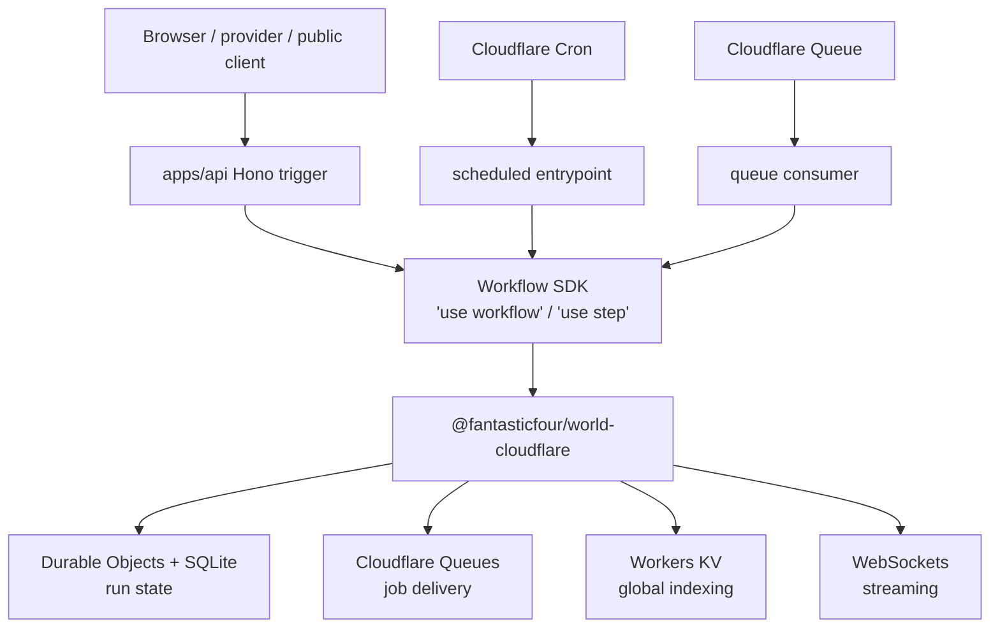
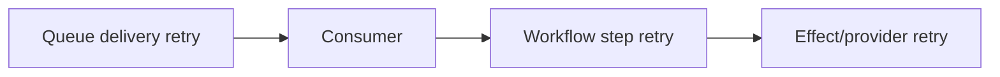

# Workflows and queues

## Locked architecture

Workflow SDK owns durable, multi-step orchestration when the capability is selected. It is retained for its AI SDK integration and replaceable World boundary. The selected backend is the community `@fantasticfour/world-cloudflare` World. Cloudflare Queues is the selected buffering, fan-out, burst-smoothing, and producer/consumer primitive, but a new product keeps `queues: absent()` until a feature genuinely needs it.

Workflow definitions, triggers, queue consumers, and scheduled entrypoints live inside `apps/api`. The Hono API is the primary external workflow trigger. Queue and cron entrypoints are alternate runtime entrances into the same typed use cases/deployment—not separate applications or services.

No AWS resources are provisioned by this architecture. AWS remains the documented portability reference—SQS/S3/Lambda and another Workflow SDK World—not a second implementation maintained today. The Cloudflare World removes the earlier proposal for a long-running Postgres workflow worker.

## Cloudflare World mapping



The World is an adapter boundary. Workflow source code should use Workflow SDK's programming model and must not import the World's Durable Object, Queue, or KV internals. Domain work inside steps uses ordinary Effect services so changing Worlds does not rewrite product behavior.

## Placement and triggering

```text
apps/api/src/
  workflows/       # orchestration definitions and versioned inputs
  steps/           # side-effecting idempotent steps
  queues/          # consumers; may start workflows
  scheduled/       # tiny cron entrypoints; start workflows
  http/            # Hono/oRPC endpoints that accept/start/signal/cancel
```

Hono authenticates/authorizes an external start, persists product operation intent where needed, supplies a stable idempotency key, starts the workflow, and returns an operation/run reference. It does not wait for long workflow completion in an HTTP request. Queue and cron handlers invoke the same service boundary directly rather than making loopback HTTP calls.

The World and its Durable Objects/Queues/KV are infrastructure under the Workflow SDK interface. They are not a second product/backend, and ordinary product code does not address them directly.

## Decision rule

| Need | Use |
| --- | --- |
| Several dependent steps, waits, compensation, or durable state | Workflow SDK |
| A delayed follow-up lasting minutes/days | Workflow SDK |
| Durable AI agent run | Workflow SDK around AI SDK steps |
| Thousands of independent items needing backpressure | Cloudflare Queue |
| Fan-out to many homogeneous consumers | Cloudflare Queue |
| Fire-and-forget work that still must not be lost | Queue or workflow; never a floating promise |
| Short safe retry inside one operation | Effect retry policy |
| Scheduled business process | Cron trigger starts a workflow |

A queue consumer may start a workflow for an item that becomes multi-step. A workflow may publish many independent items to a queue. This does not merge their responsibilities.

## Workflow design

- Workflow functions orchestrate; step functions perform side effects.
- Step inputs and outputs are small, serializable, versioned, and free of live database/provider objects.
- Each side-effecting step has an idempotency key derived from workflow/run/step identity or a stable business operation ID.
- Long waits use workflow suspension, not an active timer or Worker duration.
- Domain behavior inside a step runs through Effect services.
- Compensation is explicit. A failed payment/provisioning flow does not assume database rollback can undo remote side effects.
- Workflow status visible to users is projected into product state when needed; do not expose raw backend state as the product model.
- Every externally startable workflow checks an operation/idempotency record so repeated Hono requests cannot create duplicate business work.

## Queue design

Every important queue defines:

- message schema and version;
- producer owner and consumer owner;
- maximum attempts and backoff;
- batch size and concurrency;
- idempotency/deduplication behavior;
- timeout and partial-batch semantics;
- dead-letter queue;
- alert threshold, DLQ ownership, and bounded manual replay conditions;
- retention and sensitive-data classification.

Acknowledgement means the consumer has durably completed or handed off the work. Parsing failures caused by an unknown future schema should be quarantined, not retried forever.

The application queue envelope assumes at-least-once, possibly unordered delivery and is provider-neutral. It carries an opaque operation/message ID, schema version, correlation, organization ID where applicable, and a bounded payload. The conservative default is 64 KiB, batches of 10, and five delivery attempts before DLQ. Large data travels through R2/object references. These semantics permit a later SQS adapter without changing use cases.

## Retry layering



The diagram shows possible layers, not permission to enable all of them aggressively. Set one primary retry owner. Provider calls use short retries only for documented transient failures and only when idempotent. Workflow retries handle durable step failure. Queue retries handle consumer delivery failure. Record attempt numbers in tracing.

## Idempotency examples

- Email: unique key `welcome-email:user:{userId}:v1` recorded before/with provider send state.
- Billing event: Polar event ID plus local event type in a unique webhook ledger.
- File processing: object version/ETag + pipeline version.
- AI generation: product operation ID; decide whether a retry reuses or incurs a second model call.
- Queue-to-workflow handoff: queue message ID maps to a unique workflow/business operation record.

## Schedules

Cloudflare Cron Triggers should start Workflow SDK workflows. The cron handler remains tiny and idempotent. The workflow owns pagination, retries, checkpoints, and observable completion. Scheduled email digests, cleanup, billing reconciliation, and data retention jobs follow this pattern.

## Compatibility and operational risk

`@fantasticfour/world-cloudflare` is community-maintained, young, and has a much smaller adoption footprint than official Workflow SDK Worlds. Treat this as a deliberate bleeding-edge bet:

- pin exact Workflow SDK and World versions;
- run the World's interface/conformance tests where available;
- test deploy upgrade, resume-after-upgrade, duplicate delivery, cancellation, long sleep, and failure recovery;
- keep workflow definitions compatible across rolling deployments;
- export run/step identifiers into Sentry/evlog;
- expose enough non-production/admin inspection to diagnose, retry, or cancel a stuck run without building a full operational-runbook system;
- review package provenance, permissions, and release changes before upgrades.

Do not silently fall back to storing workflow state in PlanetScale. If the community World fails the production bar, use the World escape hatch deliberately.

## What not to do

- Do not build a second orchestration state machine on top of Queues.
- Do not use unawaited promises for important post-response work.
- Do not pass large file bodies or huge model outputs through queue messages; pass R2/object references.
- Do not assume at-least-once delivery means exactly-once side effects.
- Do not couple domain workflows to Cloudflare World storage tables/classes.
- Do not let a cron invocation iterate through an unbounded production dataset directly.
- Do not create `apps/workflows` until independent ownership/scaling/deployment is a measured requirement.
- Do not make queue/cron consumers call Hono over HTTP to reach use cases in the same Worker.

## Escape hatches

- Replace the World with an official managed or self-hosted World while keeping Workflow SDK source.
- Replace the `JobQueue` adapter with SQS or another at-least-once queue while retaining the application envelope/consumer contract.
- Introduce Trigger.dev or dedicated compute for jobs that require large memory, FFmpeg, Playwright, GPUs, or long-running Node/Bun processes that do not fit Workers.
- Graduate to Temporal if replayable workflow correctness, long-lived multi-party processes, or operational controls become core product infrastructure.
- Introduce Kafka/Redpanda only when retained streams, replay, multiple independent consumer groups, and event-log semantics are proven requirements.

## Primary references

- [Workflow SDK](https://workflow-sdk.dev/)
- [Workflow SDK repository](https://github.com/vercel/workflow)
- [`@fantasticfour/world-cloudflare`](https://www.npmjs.com/package/@fantasticfour/world-cloudflare)
- [Cloudflare Queues](https://developers.cloudflare.com/queues/)
- [Cloudflare Durable Objects](https://developers.cloudflare.com/durable-objects/)
- [Capability activation and release readiness](25-capability-activation-and-release-readiness.md)
