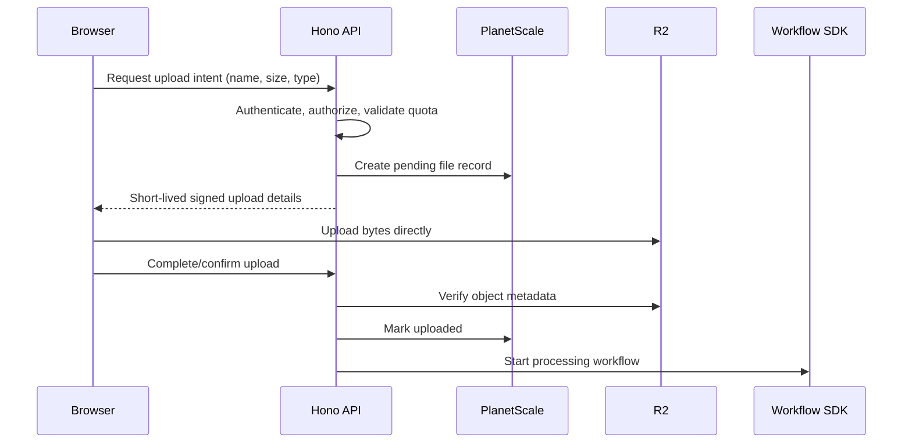

# Object storage

## Default

Cloudflare R2 stores object bytes. PlanetScale Postgres stores file metadata, ownership, status, derived-asset relationships, retention policy, and application authorization facts. Workflow SDK orchestrates scanning, extraction, transcoding, chunking, embedding, and other asynchronous processing.

The Hono API authorizes upload/download intents and records product metadata. Do not proxy ordinary object bytes through either TanStack Start application when direct signed R2 transfer is appropriate.

## Upload path

The confirmation endpoint does not trust browser-reported size, checksum, or content type. It verifies the R2 object and transitions the metadata record idempotently.

## Object keys

Use opaque, application-generated keys, for example `organization/{organizationId}/objects/{objectId}/source`. Do not use user filenames as authoritative keys. Preserve the original display name in metadata and sanitize it for `Content-Disposition`.

Keys encode stable ownership/sharding information only when that helps operations. Authorization must query product metadata; possession or guessability of a key is not authorization.

## Metadata model

A file record commonly needs:

- stable object/file ID;
- organization and uploader/owner IDs;
- R2 bucket/key and optional version/ETag;
- original display name and claimed media type;
- verified byte length and detected media type;
- lifecycle status such as pending, uploaded, processing, ready, quarantined, failed, deleted;
- checksum where useful;
- retention/deletion timestamp;
- processing pipeline version and last error code;
- parent/source relationship for derived objects.

Avoid a single `url` column as the model. URLs expire, CDN hostnames change, and private objects need authorization before a signed URL is issued.

## Downloads

- Public assets: use a controlled public bucket/domain or Worker/CDN route with deliberate cache headers.
- Private assets: authorize through the application and return a short-lived signed URL or stream through a narrowly scoped authorization Worker when signing cannot meet policy.
- Large media: use range requests and appropriate content headers.
- Derived artifacts: serve the derived object while retaining lineage to the source and processing version.

## Processing

Workflows pass object references, not object bytes. A processing workflow may:

1. verify state and acquire an idempotent processing lease;
2. scan or validate the content type;
3. extract text/metadata;
4. create thumbnails/transcodes;
5. chunk and embed text for search;
6. write derived objects to R2;
7. update Postgres metadata transactionally;
8. emit typed PostHog product events and separate Sentry/evlog operational telemetry.

Heavy workloads that exceed Workers limits use the workflow escape hatch to dedicated compute; R2's S3-compatible interface preserves the storage layer.

## Consistency and failure handling

R2 provides strong consistency for object operations, but R2 and Postgres do not share a transaction. Model intermediate states. A sweeper workflow cleans abandoned pending uploads and orphaned objects. Deletion is idempotent and records whether metadata, source bytes, derived bytes, and indexes have been removed.

If upload succeeds but confirmation fails, the user can retry confirmation. If processing fails, keep the source unless policy requires quarantine/deletion, expose a stable failure state, and allow a controlled retry using the same pipeline version or an explicit upgraded version.

## Security and abuse checklist

The instantiated security/limit baseline supplies bounded direct-upload intents, names/types normalization, and safe headers. File features still require a concrete pre-launch review:

- maximum object and multipart sizes;
- allowed/detected types and content-sniffing policy;
- per-user/organization quotas and upload-intent rate limits;
- signed URL TTL, method, key, and content constraints;
- malware or unsafe-content scanning based on product risk;
- archive bombs and parser sandboxing;
- filename/header injection;
- public-bucket exposure and cache poisoning;
- sensitive content classification and retention;
- deletion and legal hold behavior.

## What not to do

- Do not store large files as Postgres byte arrays.
- Do not trust file extensions or client MIME types.
- Do not let signed upload URLs authorize arbitrary keys or unlimited sizes.
- Do not put raw object bytes in Queue or Workflow SDK payloads.
- Do not make R2 listing the product's file index.
- Do not permanently publish private assets for frontend convenience.

The starter limit is 25 MiB per direct upload and five simultaneous upload intents per user; products with media/large-document needs select a reviewed override. See [Capability activation and release readiness](25-capability-activation-and-release-readiness.md).

## Escape hatches

- R2's S3 compatibility allows migration or dual operation with S3-compatible tools.
- A dedicated media service can consume R2 objects without changing product metadata ownership.
- CDN/domain strategy can change independently of stored object keys.

## Primary references

- [Cloudflare R2](https://developers.cloudflare.com/r2/)
- [R2 consistency](https://developers.cloudflare.com/r2/reference/consistency/)
- [R2 presigned URLs](https://developers.cloudflare.com/r2/api/s3/presigned-urls/)
- [R2 multipart uploads](https://developers.cloudflare.com/r2/objects/multipart-objects/)
