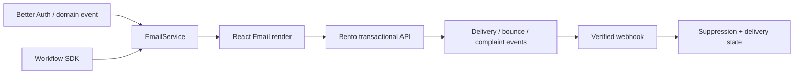

# Email architecture

## Default

Bento is the email transport and future customer-messaging platform. React Email owns source-controlled transactional templates. An Effect `EmailService` is the application boundary. Workflow SDK owns delayed, multi-step, and retryable email sequences.

Bento templates/automation may be used for marketing and lifecycle programs when a project needs them, but core transactional message markup remains in the repository.

## Flow



## EmailService contract

The application should send named product messages rather than provider requests:

```ts
sendVerificationEmail(input)
sendPasswordResetEmail(input)
sendInvitationEmail(input)
sendReceiptNotice(input)
```

The adapter renders the chosen template, constructs Bento fields, supplies a stable idempotency/deduplication key where supported or enforced locally, and records provider response metadata. Domain code does not know Bento site UUIDs, API payload shapes, or delivery statuses.

## Template conventions

- One component per transactional message with typed props.
- Shared brand/layout primitives for typography, spacing, button, preview text, footer, and legal text.
- Plain-text alternative generated or authored and reviewed.
- Absolute HTTPS URLs built from server configuration.
- Locale chosen before rendering; localized strings come from the same message ownership/workflow as product i18n or a dedicated email catalog.
- Snapshot/render tests plus visual checks in representative clients.
- User-supplied content escaped and constrained; never inject arbitrary HTML.

React Email is the source of truth even if a copy is previewed elsewhere. Avoid editing transactional templates only in a provider dashboard.

## Transactional versus marketing

Classify every message. Authentication codes, password resets, receipts, security alerts, and required account notices are transactional. Product education, newsletters, announcements, and win-back sequences are marketing/lifecycle messages and must respect consent/unsubscribe rules.

Bento's transactional flag can bypass unsubscribe state, so the adapter must expose only named, reviewed transactional templates—not a generic `transactional: true` option callable from arbitrary product code.

## Durable sequences

Workflow SDK owns onboarding follow-ups, scheduled reminders, digests, and retryable notification chains. Each send is an idempotent step. Long waits use workflow suspension. A change in user state before a delayed message causes the workflow to re-check eligibility, not blindly send stale content.

High-volume digest fan-out may use a Queue to buffer recipients; each item then renders/sends idempotently or starts a per-recipient workflow if the sequence is multi-step.

## Delivery events and suppression

Verify webhook signatures and persist provider event IDs. Track bounce, complaint, delivery, and suppression state in a small local projection so the app can avoid repeatedly attempting known-bad recipients and can explain operational outcomes. Bento remains authoritative for transport details; the app owns product eligibility and audit requirements.

## Operational setup

- Authenticate sending domains with SPF, DKIM, and applicable DMARC policy.
- Separate production and development/staging recipients/domains or use a safe capture strategy.
- Prevent test/previews from emailing real users.
- Rate-limit user-triggered login, reset, invite, and contact flows.
- Alert on send failures, bounce/complaint spikes, and stuck workflows.
- Avoid duplicate sends across retries using a local ledger keyed by message intent.
- Store secrets only server-side through Alchemy/Effect Config.

Compatibility note: Bento's documented direct email API is queued and rate limited. Confirm current per-site throughput, attachment limitations, webhook availability, and sandbox/testing behavior before launch. Link to R2-hosted attachments rather than assuming file attachment support.

## What not to do

- Do not call Bento directly from React, Better Auth callbacks, or domain modules.
- Do not use marketing automation for password resets or other security-critical messages.
- Do not mark arbitrary mail transactional to bypass consent.
- Do not retry a send without deduplication.
- Do not include secrets or highly sensitive data in email bodies/URLs.
- Do not depend on provider-dashboard templates for messages required to run the app locally and in tests.

## Escape hatches

- Replace the Bento adapter with Resend, Postmark, or Cloudflare Email Service while retaining React Email templates and application message names.
- Add a second bulk marketing platform without changing transactional delivery if Bento's lifecycle tooling becomes insufficient.
- Cloudflare Email Service is the notable future challenger because native Worker bindings and Queue-delivered events would align closely with this architecture once mature enough.

## Primary references

- [Bento developer API](https://bentonow.com/docs/developer_guides/introduction)
- [Bento transactional email API](https://bentonow.com/docs/emails_api)
- [Bento transactional email operations](https://bentonow.com/docs/operations/transactional-email)
- [React Email](https://react.email/docs/introduction)

