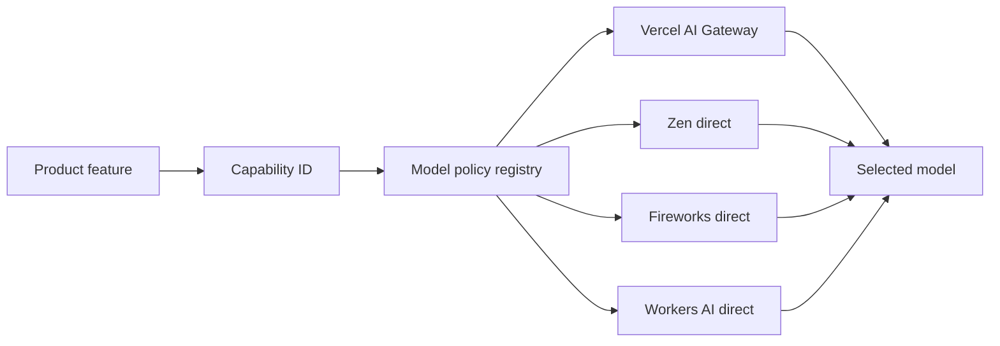
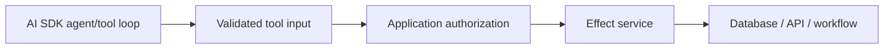

# AI stack

## Default

- AI SDK 7 for text, structured generation, tools, agents, embeddings, streaming, and multimodal provider access.
- AI SDK UI plus AI Elements for chat and AI-native React experiences.
- A central model/provider registry and feature-level capability configuration.
- Vercel AI Gateway as the default provider route.
- Direct OpenCode Zen, Fireworks, and Cloudflare Workers AI providers when they offer trust, cost, model, latency, or data-path advantages.
- Sentry AI observability for production traces and `vitest-evals` for repository-owned quality tests.

The application does not choose one permanent model vendor. It chooses stable product capabilities.

All trusted AI execution, tool authorization, provider keys, usage accounting, and durable-agent starts live in the Hono backend. TanStack Start/AI Elements render the customer/admin experience and consume safe streams/contracts.

## Capability registry

Feature code asks for a capability such as:

```text
chat.fast
chat.smart
chat.premium
coding.agent
extract.structured
classify.bulk
reason.complex
vision.general
embedding.default
image.default
voice.default
```

Configuration maps each capability to provider, model, settings, limits, fallback chain, budget class, and data policy. Model names exist in one registry/config layer—not in routes, React components, prompts, or billing logic.



## Registry responsibilities

- Resolve a logical capability to an AI SDK model instance.
- Apply feature defaults: temperature, max output, tool policy, structured schema, timeout.
- Enforce allowed provider/model combinations per environment and organization/plan.
- Attach telemetry attributes without logging prohibited content.
- Return model/pricing metadata needed for usage accounting.
- Support controlled fallback only when semantics remain acceptable.
- Permit test substitution with deterministic fake/replay models.
- Expose a deterministic fake/no-op route for fully local development and bounded synthetic production smoke tests.

Do not build an overly generic internal AI framework. AI SDK is already the provider abstraction. The local layer adds product policy and names, not another copy of every SDK API.

## Provider routing

Vercel AI Gateway is the default because it centralizes model access, routing, usage, budgets, and failover while remaining compatible with AI SDK. It is not mandatory for every call.

- Use Zen direct for trusted/coding-oriented routes when preferred.
- Use Fireworks direct for economical open models, embeddings, or custom/fine-tuned workloads.
- Use Workers AI direct when Cloudflare locality, pricing, or a supported model makes it the best fit.
- Do not place Cloudflare AI Gateway in front of Vercel AI Gateway by default. One gateway is enough; use direct providers for exceptions.

Fallback is not automatically safe. Switching models can change tool calling, JSON reliability, refusal behavior, context limits, language quality, and cost. Define fallback by capability and verify it with evals.

## Chat and generative UI

AI Elements fits the selected component stack because it is source-owned and built around shadcn/Tailwind patterns. Use it for message lists, citations, tool states, attachments, reasoning disclosure, and prompt input. AI SDK UI owns message/stream transport.

The server remains authoritative for conversation access, tool authorization, usage charging, and system prompts. The browser never supplies trusted tool definitions or unrestricted provider/model IDs.

Persist conversation state only when the product needs history. Separate display messages from provider-specific wire messages. Store enough provenance to reproduce/debug behavior without assuming full prompt retention is always legally or ethically acceptable.

## Tools and agents

AI tools are thin adapters:



The model proposes a tool call; Zod validates it; application policy authorizes it; an Effect service performs it. The model never becomes the business-logic or authorization layer.

- Short-lived bounded tool loops use AI SDK agent primitives.
- Durable/long-running agents run inside Workflow SDK, with side effects in durable steps.
- Destructive, financial, privacy-sensitive, or externally visible actions may require explicit user approval.
- Tool results are minimized and filtered to prevent cross-organization or sensitive-data leakage.

Do not add LangChain, LangGraph, or Mastra until a concrete feature needs an abstraction AI SDK and Workflow SDK do not provide.

## Structured generation

Use Zod schemas for structured model output and still treat the parsed result as untrusted business input. Schema conformance does not prove factuality, authorization, or safety. Validate referenced IDs against the database and apply deterministic domain rules after generation.

## RAG and semantic search

R2 stores source documents. A Workflow SDK ingestion pipeline extracts and chunks content, invokes the embedding capability, and stores chunks/vectors in PlanetScale with organization and source metadata. Retrieval applies organization authorization and structured filters before similarity search. Prompt context records source IDs and chunk versions for citations and debugging.

Avoid a separate vector database until Postgres demonstrates a measurable limit.

## Usage, cost, and billing

Record normalized usage at the feature operation boundary:

- actor, organization, product operation ID;
- capability ID and resolved provider/model;
- input/output/cache tokens or provider-native units;
- model-reported and locally estimated cost;
- latency, finish reason, retry/fallback count;
- Polar meter event ID/status;
- trace/workflow ID.

Send billable usage to Polar idempotently. Product enforcement checks local entitlements/credit policy before expensive work and reconciles against Polar customer/meter state. Do not use token counts as the only product unit if user value is better represented by generations, documents, minutes, or jobs.

PostHog receives only curated product outcomes such as `ai_generation_completed` with safe capability/duration/category metadata. Raw prompts, completions, tools, filenames, and model payloads never become product-analytics properties. Sentry AI observability owns reviewed operational spans separately.

## Safety and privacy

The instantiated baseline supplies conservative AI limits: 4,096 output tokens, eight tool iterations, US$0.25 per request, US$5 per user/day, and US$25 per organization/day unless a reviewed capability profile overrides them. Every AI feature still requires its own pre-launch review: prompt injection, tool authorization, data exfiltration, organization isolation, provider data retention, PII/secrets in traces, output moderation, user consent, copyrighted/private documents, rate limits, cost ceilings, runaway loops, and human approval.

## What not to do

- Do not hardcode model IDs in feature code.
- Do not let the client pick arbitrary providers or premium models.
- Do not automatically retry costly generations without usage/idempotency semantics.
- Do not log prompts, completions, or tool payloads by default without classification and redaction.
- Do not grant tools ambient database/provider access.
- Do not treat a successful HTTP response as a successful AI feature; quality belongs in evals.
- Do not add a vector database, agent framework, or second gateway by default.

See [Capability activation and release readiness](25-capability-activation-and-release-readiness.md) for limit ownership and [Team tenancy and identity](26-team-tenancy-and-identity.md) for organization isolation.

## Escape hatches

- Swap gateways/providers through the registry.
- Add assistant-ui for a chat-first product.
- Add Braintrust/Langfuse later for dataset curation, human review, large experiment management, or continuous online evals.
- Move retrieval to a dedicated search/vector service after a measured limit while retaining source/chunk IDs and rebuilding from R2.
- Move heavy agent steps to dedicated compute while keeping Workflow SDK orchestration.

## Primary references

- [AI SDK TanStack Start guide](https://ai-sdk.dev/docs/getting-started/tanstack-start)
- [AI SDK provider registry](https://ai-sdk.dev/docs/reference/ai-sdk-core/provider-registry)
- [AI Elements](https://elements.ai-sdk.dev/docs)
- [Vercel AI Gateway](https://vercel.com/ai-gateway)
- [PlanetScale vector extensions](https://planetscale.com/docs/postgres/extensions)
