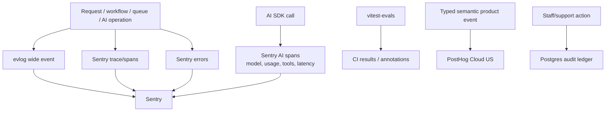

# Observability and evals

## Default

Sentry is the production observability backend for errors, performance traces, releases, logs, and AI observability. evlog is the application logging API and emits structured wide events into Sentry. Vitest covers deterministic tests; `vitest-evals` covers AI quality and regression evals in the repository and CI.

PostHog is a separate product-analytics/replay system; the append-only Postgres admin audit ledger is a separate durable business record. Neither replaces Sentry/evlog, and operational telemetry must not be reshaped into customer funnel events.

Do not add Axiom, Langfuse, Braintrust, or another observability/eval platform by default. Axiom is the first log-warehouse escape hatch when query volume or retention outgrows Sentry. A specialized AI platform is added only when dataset/experiment/human-review operations justify it.

## Telemetry model

Use one correlation vocabulary across telemetry:

- release manifest, Git commit, Cloudflare version IDs, and environment/stage;
- service and route/procedure name;
- request and trace IDs;
- actor type and non-PII user/organization IDs when policy permits;
- workflow run/step, queue/message, webhook/provider event IDs;
- product operation and idempotency key;
- AI capability, provider/model, token/usage/cost metadata;
- feature-flag snapshot/evaluation reason where relevant.
- production-test marker and synthetic organization for green/pre/post-cutover checks.

## evlog conventions

Emit one structured wide event per request/operation and enrich it as work proceeds. Record meaningful product and dependency fields instead of many disconnected prose lines. Use stable field names and bounded values. Errors include structured context and a safe message; full exceptions go to Sentry.

On Workers, make drains compatible with invocation lifetime (`waitUntil`/runtime-supported deferred delivery) and avoid in-memory batching assumptions designed for long-lived servers. Verify the current evlog Hono/Cloudflare/TanStack integration behavior before relying on request-scoped helpers; use explicit context if AsyncLocalStorage behavior is not available in the selected runtime path.

## Sentry responsibilities

- Capture unhandled defects and explicit reported failures with release/source-map context.
- Trace browser → Worker → oRPC/Effect → database/provider/workflow boundaries.
- Record important structured logs alongside traces.
- Track performance regressions and provider latency.
- Instrument AI SDK calls for model/provider, token/cost, tool execution, and failure visibility, subject to privacy policy.
- Alert on user impact and operational objectives rather than every individual exception.
- Compare blue/green release health using explicit Worker version metadata before and after cutover.

Cloudflare can export OpenTelemetry logs/traces to Sentry. Prefer a coherent ingestion design and avoid double-sending the same telemetry through both SDK and platform exporters unless their responsibilities are deliberately distinct.

## Privacy and cardinality

- Never send secrets, session tokens, raw auth headers, provider keys, or payment details.
- Treat prompts, completions, tool inputs, emails, filenames, and document contents as potentially sensitive.
- Use allowlisted attributes rather than dumping request objects.
- Hash or omit user identifiers according to product policy.
- Bound high-cardinality values and do not use raw error messages or full URLs as metric dimensions.
- Configure environment-specific sampling; retain all errors and rare critical operations while sampling routine success traffic.

## Product analytics and audit separation

PostHog receives typed semantic events through `packages/analytics`, not evlog wide events. Server-side product success events are emitted from authoritative Hono state transitions; browser events cover page/navigation/interaction context. Staff and impersonated activity is excluded from customer analytics.

The Postgres admin audit ledger records durable who/what/why/before/after/result data. Sentry receives correlation IDs and safe operational context only. An audit record must remain complete even if Sentry/PostHog delivery fails, and analytics delivery never participates in a product transaction.

See [Product analytics](21-product-analytics.md) and [Admin and support](20-admin-and-support.md).

## AI eval architecture

`vitest-evals` keeps eval cases, scorers, fixtures, and harness setup in TypeScript beside the feature. Use the AI SDK harness. Divide tests into:

- deterministic schema/tool-policy tests;
- replay/cassette tests where supported;
- rubric or judge-based quality tests;
- safety/adversarial cases;
- fallback/provider comparison tests;
- latency and cost budgets.

Every eval case records feature/capability, prompt and fixture version, expected rubric, model policy version, and whether live provider access is required. Judge models are not ground truth; calibrate them against human-reviewed examples and use multiple deterministic checks where possible.

## CI policy for evals

- Fast deterministic/replay evals run on every PR.
- Small live-model smoke evals may run on trusted PRs with strict budget/concurrency.
- Expensive suites run on demand, nightly, or before release.
- Version-targeted production smoke/eval checks run against zero-traffic green releases with synthetic data and strict provider/budget controls.
- Forked/untrusted PRs never receive provider secrets.
- Regressions use reviewed thresholds and variance-aware assertions, not exact prose matching.
- Store summaries and artifacts without retaining prohibited prompt/customer data.

## Operational objectives

Each project should define a small set of service-level indicators: request success/latency, workflow completion age, queue backlog/DLQ growth, email failure/bounce rate, billing webhook lag, AI feature success/cost/latency, and database query health. Alert on sustained user-visible deviation with an owner and a short response/recovery note. A comprehensive runbook platform is deferred.

## What not to do

- Do not log every internal line and call it observability.
- Do not send raw prompts/completions to Sentry without a data policy.
- Do not use Sentry issue count as the only reliability metric.
- Do not run costly live evals on every untrusted PR.
- Do not accept one LLM judge score as proof of product quality.
- Do not add Axiom/Langfuse/Braintrust merely because an integration exists.
- Do not send evlog request events wholesale to PostHog or use PostHog as an error/audit backend.

## Escape hatches

- Add Axiom as a second evlog/OTLP drain for high-volume search and retention.
- Add Braintrust or Langfuse when managed datasets, experiments, continuous production evals, or human review become a workflow requirement.
- Change Sentry ingestion between SDK and Cloudflare OTLP export without changing the application's wide-event vocabulary.

## Primary references

- [Sentry for Cloudflare](https://docs.sentry.dev/platforms/javascript/guides/cloudflare/)
- [Cloudflare OpenTelemetry export to Sentry](https://developers.cloudflare.com/workers/observability/exporting-opentelemetry-data/sentry/)
- [Sentry AI/LLM monitoring](https://docs.sentry.io/product/llm-monitoring/getting-started/)
- [evlog](https://github.com/HugoRCD/evlog)
- [vitest-evals](https://vitest-evals.sentry.dev/docs)
