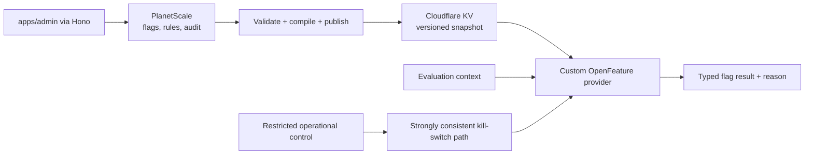

# Feature flags

## Default

Build a deliberately small platform-native feature-flag system with an OpenFeature-compatible public interface. PlanetScale Postgres is the authoring/source-of-truth database. A publish step compiles environment-specific snapshots into Cloudflare KV. Workers evaluate normal flags locally against the snapshot. Operational kill switches use a separate, stronger-consistency path. The system is expected to iterate, but new authoring/evaluation features require a demonstrated product need.

This is not a feature-flag SaaS and it is not an experimentation platform.

PostHog feature flags remain disabled. PostHog may analyze typed exposure/outcome events emitted by the custom provider and product analytics boundary, but it never evaluates or authors application flags.

## Architecture



## OpenFeature boundary

Application code uses the OpenFeature evaluation API or a thin Effect `FeatureFlags` service compatible with it. The provider translates typed flag calls and evaluation context into the platform's snapshot/rules. Code never imports KV or queries the authoring tables to evaluate a flag.

Supported initial flag values:

- boolean;
- string/number/object variants;
- environment default;
- explicit user/organization override;
- attribute rules with a small allowlisted operator set;
- deterministic percentage rollout using a stable `targetingKey`.

Use OpenFeature evaluation details/reason codes for debugging. Hooks can emit sampled evaluation/exposure telemetry without coupling the engine to a future analytics backend.

## Data model

Authoring records should represent:

- immutable key and human display name;
- type and allowed variants;
- description, owner, and lifecycle state;
- per-environment defaults and rules;
- rollout salt/version;
- ordinary versus operational consistency class;
- created/updated/published metadata;
- audit history with actor and change reason.

Published snapshots are immutable/versioned documents containing only evaluation-ready data. They exclude authoring drafts and unnecessary PII. A small manifest points to the active version so publishing is atomic from the evaluator's perspective.

## Evaluation context

Use stable, low-sensitivity fields such as:

```text
targetingKey
organizationId and optionally userId (opaque, trusted)
plan/entitlement class
country/region when justified
app version
environment
```

Do not send emails, names, arbitrary request objects, or unbounded custom data into every evaluation. Server-side policy flags use trusted server-derived context, not client claims.

Percentage rollout uses a stable hash of at least flag key, rollout salt/version, and `targetingKey`. The same subject gets the same variant until the rollout definition intentionally changes.

## Publish flow

1. Admin edits a draft in PlanetScale.
2. Server validates types, rule operators, variant references, and environment policy.
3. Compiler generates a deterministic snapshot and checksum.
4. Publish writes the immutable snapshot to KV.
5. Active-version manifest changes after snapshot write succeeds.
6. Audit entry records actor, reason, old/new versions, and outcome.
7. Evaluators pick up the version according to KV consistency/cache behavior.

Preview/dry-run evaluation shows how sample contexts resolve before publish. Rollback reactivates a previous immutable version rather than trying to reverse-edit the current one.

## Consistency tiers

Workers KV is optimized for read-heavy configuration and is eventually consistent; updates can take roughly 60 seconds or more to appear at locations with cached data. That is acceptable for ordinary releases and gradual rollouts.

Kill switches must not depend on that propagation. Use a strongly consistent store/coordinator such as a Durable Object or another explicit strong path, with restricted administration and an observable acknowledgement. The evaluator checks operational switches before the normal snapshot for the small set of capabilities classified this way.

Do not classify every flag as a kill switch. That would turn a cheap local read system into a coordination service.

## Failure policy

Each flag has an explicit safe default in code. If the snapshot is absent, invalid, or stale beyond policy, evaluation returns the safe default with an error/stale reason and emits telemetry. Operational switches define whether failure must fail-open or fail-closed per capability.

Snapshot compilation and provider evaluation share conformance fixtures so the same context produces the same result. Never run arbitrary code or user-authored expressions in the evaluator.

## Release activation

The release manifest records every flag whose safe default is required by the change. Risky behavior normally deploys inactive, is tested on the zero-traffic green version with explicit overrides/synthetic context, and is activated only after the code/schema cutover is healthy.

Rules:

- The old/disabled path must remain functional for the declared rollback window.
- A missing, corrupt, or stale snapshot resolves to the code-owned safe default.
- Ordinary KV-backed flags can tolerate propagation delay; emergency controls use the stronger path and observable acknowledgement.
- Database migrations must remain safe for blue/green versions independently of flag evaluation. A flag cannot repair incompatible schema.
- Rollback first disables associated flags, then restores application versions and applies a down migration only when data-safe.
- Temporary release flags have a removal issue/condition and are deleted after the rollback window and successful rollout.

PostHog receives exposure events only through the typed analytics adapter, with stable flag key, variant, evaluation reason, snapshot version, and opaque subject/organization context. Staff/support activity is excluded from customer experiments and funnels.

## Lifecycle

Every flag has an owner and removal condition. Release flags are temporary: after rollout, remove the old code path and archive the flag. Operational flags may be long-lived but require periodic drills. Permission/entitlement policy is not a feature flag; use authorization and entitlement services.

## What not to build initially

- No experiment statistics or causal analysis.
- No visual nested rule-tree builder.
- No regex/eval language with dozens of operators.
- No client-side access to full targeting rules.
- No Durable Object in the ordinary hot evaluation path.
- No database query per flag check.
- No simultaneous support for multiple external flag vendors.
- No PostHog flag SDK/evaluation alongside the custom provider.
- No dynamic flag dependency graph, arbitrary expression language, or organization-authored policy engine.

The first useful version needs typed values, environment and explicit organization/user overrides, a small allowlisted rule set, deterministic rollout, immutable snapshot publication, safe defaults, audit history, and the strong kill-switch path. Rich UI, experimentation, approvals, segments, and dependency features graduate independently rather than arriving as one internal platform project.

## Testing

- Unit-test hashing, rule precedence, type behavior, fallbacks, and reason codes.
- Golden-test compiled snapshots for deterministic output.
- Contract-test the custom provider against OpenFeature expectations.
- Integration-test publish → KV → Worker evaluation with Cloudflare's Vitest integration.
- Test stale/missing/corrupt snapshots.
- Drill kill-switch activation, propagation acknowledgement, and recovery.
- Test organization isolation and ensure evaluation context cannot override trusted attributes.
- Test release-manifest safe defaults, green-version overrides, disable-before-rollback behavior, and flag cleanup fixtures.

## Escape hatches

The OpenFeature-compatible interface permits replacing the provider with a SaaS or open-source backend later. PlanetScale authoring data can be exported. The application does not change every call site because evaluation stays behind the provider/Effect service.

## Primary references

- [OpenFeature evaluation API and providers](https://openfeature.dev/docs/reference/concepts/evaluation-api/)
- [OpenFeature evaluation context](https://openfeature.dev/docs/reference/concepts/evaluation-context/)
- [OpenFeature hooks](https://openfeature.dev/docs/reference/concepts/hooks/)
- [How Cloudflare KV works and its consistency model](https://developers.cloudflare.com/kv/concepts/how-kv-works/)
- [Cloudflare Durable Objects](https://developers.cloudflare.com/durable-objects/)
- [Team tenancy and identity](26-team-tenancy-and-identity.md)
