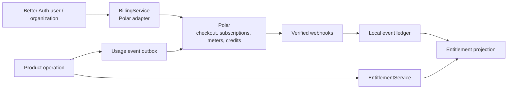

# Billing, usage, credits, and entitlements

## Default

Polar is the billing platform and Merchant of Record. It owns checkout, payment collection, international sales-tax handling within its MoR scope, subscriptions, invoices, customer portal, usage events/meters, prepaid credits, and billing benefits. Better Auth supplies the user/organization identity association and its Polar plugin. The billable product customer is the Better Auth organization by default; individual users derive access through membership.

The application owns product-facing access semantics, local billing/audit projections, and enforcement. Provider state is not scattered through product code.

The Hono backend is the only runtime that calls Polar or accepts Polar webhooks. Customer/admin TanStack applications use oRPC contracts. The staff console reads local projections by default and offers audited refresh, reconciliation, grant, and correction workflows rather than unrestricted Polar administration.

## Boundary



Product code asks questions such as:

```text
canUse("ai.chat.premium")
limit("projects")
remaining("ai.generations")
entitlement("storage.gb")
```

It does not check `subscription.status === "active"`, product IDs, benefit IDs, or Polar SDK objects.

## What Polar owns versus the app

| Concern | Owner |
| --- | --- |
| Checkout/payment UI and payment method collection | Polar |
| Merchant of Record, covered taxes/invoices/disputes | Polar |
| Subscription lifecycle and billed prices | Polar |
| Usage event aggregation/meters | Polar |
| Credit balances and grants | Polar |
| Customer portal | Polar |
| Mapping a purchase to product capabilities | Application entitlement projection |
| Authorization before product operations | Application |
| Local audit/idempotency/webhook ledger | Application |
| Support grants, trials, enterprise/manual access | Application policy, optionally synchronized with Polar |
| Cost-aware AI model routing | Application AI policy |

Polar benefits/customer state can seed or simplify the projection, but the application boundary remains useful for enterprise contracts, support overrides, migration, degraded operation, and product vocabulary.

## Customer association

Use Better Auth's Polar integration to create or associate customers with stable external IDs. Organization purchases carry the canonical organization reference, and members derive access through membership plus the organization's entitlement—not by each having an individual subscription. A future consumer-only exception requires an explicit architecture override; it is not the starter default.

Customer creation is idempotent and recoverable. A failed Polar call after local sign-up must not corrupt authentication. Reconciliation can repair missing associations.

## Checkout and portal

The server chooses allowed product/price identifiers from a reviewed catalog. The client may request a product slug, but cannot submit arbitrary Polar product IDs, prices, redirect URLs, or customer references. Return/success screens treat the browser redirect as informational; verified webhook/customer state drives fulfillment.

Use Polar's customer portal for subscription/payment management. Product UI can show a normalized summary and link into the portal rather than reimplementing billing operations.

## Webhooks and projection

1. Verify the raw request signature and timestamp.
2. Insert the Polar event ID/type into a unique local ledger.
3. Acknowledge duplicates without reapplying effects.
4. Persist normalized billing state and enqueue/start durable projection work.
5. Recompute affected entitlements from authoritative inputs.
6. Record projection version and source event.
7. Reconcile periodically against Polar customer state to detect missed/out-of-order events.

Design for out-of-order delivery. Recompute current state where possible rather than applying irreversible incremental assumptions.

## Usage events

Features produce normalized product usage records with a stable operation ID. A durable outbox/workflow sends them to Polar and records the resulting event ID/status. Retries reuse the idempotency identity.

For AI, capture provider-native token/compute details for cost analysis, but choose customer-facing meters that make product sense. One feature operation may produce multiple internal cost measurements but one billable “generation” event.

Never wait to report a month of usage from volatile logs. Usage is durable application data until Polar acknowledges it.

## Credits and enforcement

Polar credits deduct against meter balances and can fall through to metered overage when configured. Polar documentation notes that applications remain responsible for blocking usage when the chosen product policy requires it. Therefore:

1. Check local entitlement/limit/credit policy before costly work.
2. Reserve or record the operation idempotently to reduce concurrent overspend.
3. Execute the work.
4. Finalize measured usage and send the Polar event.
5. Reconcile local display/enforcement state with Polar balances.

Strong prepaid-only guarantees under concurrency may require a strongly consistent local reservation/ledger. A cached Polar balance alone is not sufficient.

## Degraded operation

Define per capability:

- whether temporary Polar unavailability fails open or closed;
- maximum acceptable staleness of entitlement projection;
- grace periods for renewal/payment transitions;
- support override and audit process;
- reconciliation alert thresholds.

Core account access may remain available while premium consumption is temporarily restricted. Avoid turning a billing API outage into total application downtime unless the product explicitly requires it.

PostHog may receive curated commercial product events such as checkout completion or plan-class change after the authoritative Hono/ledger transition. It never receives raw payment/provider payloads and never becomes the usage, credit, entitlement, or audit ledger.

## Security and compliance

Polar removes significant MoR/tax burden but not all business obligations. The product still owns privacy, terms, refund/support policy, revenue recognition/accounting context, sanctions/acceptable-use considerations, and correct representation of what is sold. Never store raw card details.

## What not to do

- Do not fulfill from checkout redirect query parameters.
- Do not scatter Polar product/benefit IDs through UI and domain code.
- Do not equate authentication with a paid entitlement.
- Do not trust an eventually updated balance to enforce strict prepaid concurrency.
- Do not double-report usage after retries.
- Do not attempt to support Polar and another billing provider simultaneously through a huge lowest-common-denominator abstraction.

## Escape hatches

The `BillingService` and product entitlement vocabulary allow a later migration to Stripe, Dodo, Paddle, enterprise invoicing, or mixed billing. Migrate one provider deliberately; do not maintain speculative parallel adapters. Local event/usage ledgers and normalized customer references are the migration foundation.

See [Team tenancy and identity](26-team-tenancy-and-identity.md) for organization ownership and [Capability activation and release readiness](25-capability-activation-and-release-readiness.md) for conservative spend/usage limits.

## Primary references

- [Polar Merchant of Record](https://polar.sh/docs/merchant-of-record/introduction)
- [Polar products and pricing models](https://polar.sh/docs/features/products)
- [Polar usage-based billing](https://polar.sh/features/usage-billing)
- [Polar credits](https://polar.sh/docs/features/usage-based-billing/credits)
- [Better Auth Polar plugin](https://better-auth.com/docs/plugins/polar)
