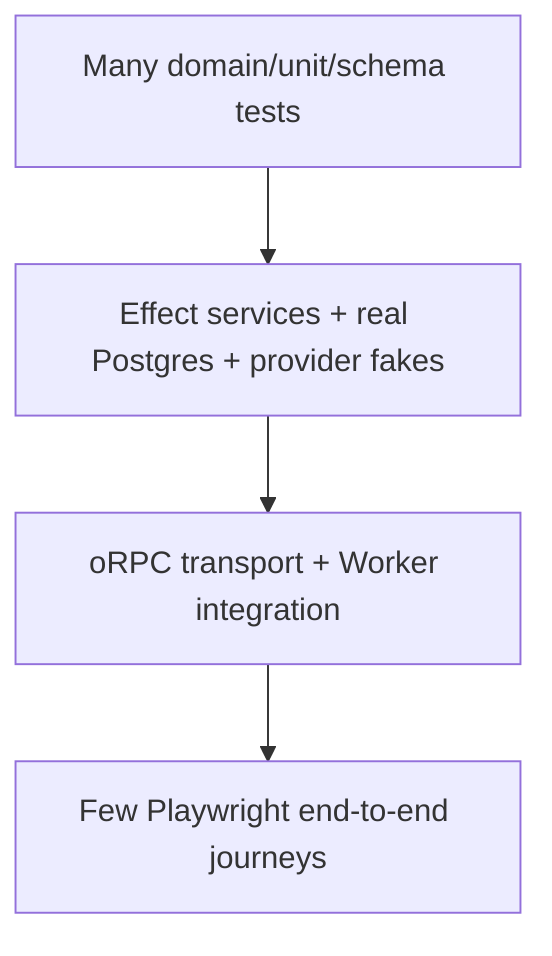

# Testing strategy

## Default stack

- Vitest for units, domain logic, Effect services, utilities, and deterministic integration tests.
- Cloudflare's Vitest integration for Worker code and real bindings/runtime behavior.
- `vitest-evals` for AI quality/regression tests using the AI SDK harness.
- Playwright for browser-level end-to-end and component/UI behavior.
- oRPC native testing for direct procedure tests, plus a smaller transport/OpenAPI suite.
- Real disposable PostgreSQL locally and in CI, pinned to the same production Postgres version and required extensions.
- Migration upgrade and claimed-safe downgrade tests tied to the complete release manifest.
- Version-targeted production smoke tests against zero-traffic green Cloudflare versions using a synthetic organization.
- Capability-manifest/Effect-Layer/Alchemy-plan consistency checks and release-readiness validation.

PlanetScale development branches are not part of the normal PR test suite.

## Test pyramid by boundary

AI evals run beside this pyramid because quality checks are neither ordinary unit tests nor browser tests.

## Unit and domain tests

Pure domain rules run without network, database, real clock, random IDs, or provider SDKs. Effect services receive test Layers for clock, ID generation, billing, email, flags, and object storage. Test expected typed failures as values and defects separately.

Zod schemas have fixture tables for valid normalization, invalid boundaries, unknown fields, and versioned durable payloads. Feature-flag hashing, entitlements, billing usage mapping, and workflow idempotency keys deserve especially dense deterministic coverage.

## Database integration

Tests start a real ephemeral Postgres instance, apply the same generated Drizzle migrations used in production, enable the same required extensions, run tests, and discard the instance. Pin the image/service to the production major and preferably minor version.

Test:

- constraints and transaction invariants;
- migration from representative previous schema;
- indexes/query plans for critical queries where practical;
- full-text/vector behavior if used;
- concurrency/idempotency conflicts;
- organization isolation across queries, constraints, caches, and multiple memberships;
- forward migration plus new-application behavior;
- down migration plus representative previous-application/schema behavior for releases classified reversible;
- conditions that turn a conditionally reversible migration forward-only;
- rollback/partial-failure behavior without discarding post-release writes.

Mocked repositories are useful for domain tests but do not replace SQL integration tests.

## Cloudflare runtime tests

Use `@cloudflare/vitest-pool-workers` for Worker modules, service bindings, KV, R2, Queues, Durable Objects, and request/runtime behavior. Understand its isolation model: test files normally receive isolated storage and can run concurrently. Tests that intentionally share state must opt into serialized/no-isolation behavior rather than accidentally depending on order.

Test Alchemy-managed bindings through a small environment test as well, because local workerd fidelity and deployed binding configuration are different layers.

## oRPC tests

- Call procedures/handlers directly for most authorization, validation, error mapping, and domain integration coverage.
- Exercise the Fetch transport for representative procedures.
- Validate generated OpenAPI and public error/status behavior.
- Run compatibility fixtures against generated public clients when a public API is promised.
- Test streaming cancellation and partial output where used.

No separate Pact-style contract platform is needed initially.

## Browser/UI tests

Prefer Playwright in real Chromium for meaningful React UI behavior. Component tests cover dialogs, focus, keyboard navigation, forms, optimistic/pending states, localized layouts, and AI streaming states. End-to-end tests cover a few revenue/security-critical user journeys.

Run customer journeys against `apps/web` and staff/security/impersonation journeys against `apps/admin`. Admin tests verify non-staff rejection, capability enforcement, recent reauthentication, masking/reveal, persistent impersonation warnings, and append-only audit records.

Avoid making jsdom + React Testing Library the platform default. It may still be used for a specific package/component when it provides a faster, appropriate boundary, but browser behavior is tested in a browser.

## Workflow and queue tests

- Unit-test orchestration decisions with deterministic step adapters.
- Integration-test the Cloudflare World's start, wait, retry, resume, cancellation, and version-upgrade behavior.
- Test side-effect idempotency by deliberately delivering/starting twice.
- Exercise Queue retry, partial batch failure, DLQ routing, and replay.
- Test a workflow resuming after code deployment with a compatible input/output version.
- Verify stuck-run inspection and recovery procedures in a non-production stage.

## Provider contracts

Use fakes for most tests, recorded fixtures where terms/privacy permit, and a small sandbox smoke suite for Better Auth integrations, Polar, Bento, AI providers, and Sentry. Sandbox tests never run with production customers or destinations. Verify webhook signatures with provider test fixtures.

Platform capability ports have reusable behavioral suites. The Cloudflare adapter and deterministic fake must satisfy the same product semantics for object storage, Queue publishing/consumption, Workflow SDK triggering/status, feature evaluation, and model routing. A future S3/SQS/World adapter earns adoption by passing those suites; the repository does not maintain unused second-cloud adapters today.

Local defaults use Docker Compose Postgres/Mailpit plus workerd/Miniflare Cloudflare primitives. SaaS adapters are deterministic fakes or no-ops, so ordinary tests do not require vendor credentials.

## Production-targeted verification

Production tests supplement rather than replace CI and any enabled previews. After the tied migration, Alchemy uploads immutable green versions with zero customer traffic. Version overrides/preview endpoints target green for:

- health, config, binding, database, and migration-version checks;
- synthetic-organization API reads/writes and one bounded customer journey;
- workflow/queue acceptance using test-marked idempotency keys;
- email capture/allowlist and non-chargeable billing fixtures;
- AI fake or tightly budgeted smoke paths;
- error/latency/version attribution in Sentry/evlog.

After cutover, rerun essential journeys and compare release health. Synthetic events are excluded from PostHog customer analytics, Polar usage, and normal operator metrics. No test can send unrestricted email, charge a real method, mutate customer content, or invoke a destructive admin operation.

## AI evals

See [Observability and evals](11-observability-and-evals.md). Fast schema/tool/replay checks run on PRs; live-model suites have budgets, trusted-secret controls, and variance-aware thresholds. Evaluate every fallback path in the capability registry.

## CI matrix

| Job | Typical contents |
| --- | --- |
| Fast checks | typecheck, Oxlint, unit/domain tests, schema/flag tests |
| Server integration | ephemeral Postgres, migrations, Effect/oRPC integration |
| Cloudflare | Worker runtime/binding/Queue/R2/KV/DO tests |
| Browser | Playwright component/E2E, sharded as useful |
| AI fast | deterministic/replay `vitest-evals` |
| AI live | trusted scheduled/manual/release suite with budget |
| Capability/readiness | typed manifest, Effect Layer, Alchemy plan, config/limit/security/recovery policy |
| Preview smoke (opt-in) | deployed stage health, auth/database/binding checks against migrated/seeded isolated data |
| Green production smoke | version-targeted synthetic checks at 0% customer traffic |
| Post-cutover | essential journeys, release health, flag/default verification |

## What not to do

- Do not use SQLite or an in-memory fake as the only database test.
- Do not hit PlanetScale branches on every PR by default.
- Do not mock the entire application and assert implementation calls.
- Do not test only procedure internals and ignore representative transport behavior.
- Do not use a single massive serial CI job.
- Do not give secrets to forked PRs or run live AI/email/billing calls from untrusted code.
- Do not call a flaky LLM assertion a test without thresholds, repetitions/fixtures, and ownership.
- Do not call a release migration reversible unless CI proves the declared upgrade/downgrade contract.
- Do not interpret “test in production” as permission to skip CI or enabled previews, or to touch real customer/billable destinations.

## Escape hatches

- Add a small PlanetScale staging smoke suite for provider/network/proxy behavior.
- Add another browser engine for customer-impacting compatibility needs.
- Add load testing and migration rehearsal when a product has real scale/risk.
- Introduce a dedicated test environment/data platform only when coordination cost justifies it.

## Primary references

- [Vitest](https://vitest.dev/)
- [Cloudflare Workers Vitest integration](https://developers.cloudflare.com/workers/testing/vitest-integration/)
- [Cloudflare runtime test recipes](https://developers.cloudflare.com/workers/testing/vitest-integration/recipes/)
- [Playwright](https://playwright.dev/docs/intro)
- [vitest-evals](https://vitest-evals.sentry.dev/docs)
- [Testcontainers for Node.js](https://node.testcontainers.org/)
- [Capability activation and release readiness](25-capability-activation-and-release-readiness.md)
- [Team tenancy and identity](26-team-tenancy-and-identity.md)
