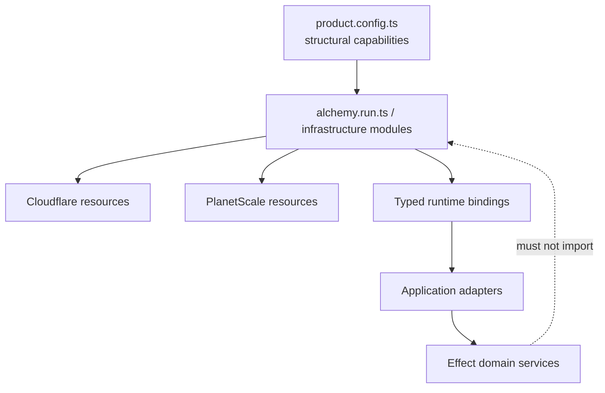

# Infrastructure and IaC

## Default

Alchemy is the sole infrastructure-as-code and deployment layer. It always provisions the customer/admin TanStack Start Workers and Hono API Worker, then provisions only the bindings/resources selected by the committed capability manifest: R2, Queues, KV, Durable Objects, Hyperdrive, Workflow World resources, observability settings, preview stages, and supported PlanetScale resources.

Alchemy is infrastructure glue. Domain and product code remain independent of it.

## Ownership boundary



Allowed Alchemy concerns:

- resource declarations and lifecycle/removal policy;
- stage/environment naming and isolation;
- typed Worker bindings and service-to-service wiring;
- deployment outputs and domains;
- runtime compatibility flags;
- infrastructure config/secrets binding;
- preview creation/destruction;
- observability export configuration.

Disallowed concerns:

- business workflows;
- billing/entitlement policy;
- API contract semantics;
- model-selection policy;
- database query logic;
- React components.

## Suggested infrastructure layout

```text
alchemy.run.ts
product.config.ts  # reviewed capability/readiness intent; never secrets
infra/
  web.ts            # customer TanStack Start Worker and app domain
  admin.ts          # staff TanStack Start Worker and admin domain
  api.ts            # Hono Worker, /api routes, versions, runtime entrypoints
  database.ts       # PlanetScale/Hyperdrive roles and bindings
  storage.ts        # R2 buckets and lifecycle choices
  messaging.ts      # Queues, DLQs, consumers
  workflows.ts      # World-required DO/KV/Queue resources
  flags.ts          # flag snapshot KV and kill-switch resources
  observability.ts  # Sentry/OTLP/export settings
  stages.ts         # naming, retention, production guards
```

Infrastructure modules may be conditionally composed from the typed capability manifest; absent modules are not provisioned. Actual Alchemy APIs evolve, so preserve responsibilities rather than copying this shape blindly.

## Application deployment

Alchemy deploys both Vite/TanStack Start applications and the Hono Worker as distinct resources. It declares the frontend domains plus same-origin `/api/*` routes to the single backend. Compatibility note: when Alchemy's Start integration supplies its Cloudflare Vite plugin, do not configure a competing plugin for the same build. Enable `nodejs_compat` only where required by the selected dependencies.

Read bindings through a small typed API environment module. Frontend apps should not need database/R2/Queue/provider bindings because they call Hono. Avoid top-level access that assumes request-scoped Worker bindings are already available.

## Immutable versions and traffic

Each production application upload has the Git SHA as a version tag/message. Alchemy uploads green versions without customer traffic, exposes preview/version identifiers for targeted smoke tests, then changes traffic according to the release coordinator. Normal releases cut from 0 to 100 percent; unusually risky releases may ramp with version affinity.

Cloudflare snapshots Worker code, bindings, compatibility settings, and relevant cache configuration per version, but stateful resources and external data are not rolled back with code. Alchemy therefore records every application version plus the stateful-resource plan in the release manifest. Routes, cron configuration, Durable Object/Workflow classes, and other script-level concerns receive explicit compatibility review.

## Database wiring

Provision or reference PlanetScale through its Alchemy provider, create least-privilege roles/credentials, and bind a Cloudflare Hyperdrive connection to the Worker. Migration credentials are separate from application runtime credentials. Cloud previews are opt-in. When selected, the default is an isolated database/branch with exact migrations and deterministic seeds; a later sanitized-snapshot source must never imply access to live production credentials/data.

## Config and secrets

Effect Config is the Hono server configuration model. Alchemy resolves deployed configuration and binds Worker secrets/environment values. Public client config remains separately allowlisted and Zod-validated.

- Secrets never enter git, logs, Alchemy outputs, or client bundles.
- CI credentials use the narrowest supported token/OIDC path.
- Production and preview credentials are separated.
- Secret rotation has a short documented procedure and does not require editing business code.
- Values discovered only at runtime cannot provision/bind infrastructure; resolve required Config in the correct Alchemy phase.
- Commit safe non-service development defaults and `.env.example`/`.dev.vars.example`; ignore generated local secrets and all SaaS credentials.
- Alchemy declares deployed secret names/bindings while actual values live in scoped stage/provider secret storage.

The earlier SOPS/OpenTofu discussion was superseded by Alchemy. Do not add a second IaC system or commit encrypted secrets by default unless the selected secret model later proves insufficient.

## Stages and lifecycle

Alchemy stages isolate resource names and state. Use stable classes:

- personal development stage;
- optional `pr-{number}` preview when the repository selects cloud previews;
- optional shared staging;
- production.

Production resources use retain/protect/removal policies appropriate to data. Preview resources default to destroy. R2/PlanetScale/DO data must never be deleted merely because a naming convention changed; review every destructive plan and migration/move semantics.

## Drift and adoption

Avoid manual dashboard changes. When emergency operations require them, reconcile/adopt the resource back into Alchemy immediately and document why. Import/adopt existing resources rather than recreating them. Keep a generated resource inventory with owners, data classification, backup/retention, and deletion policy.

## Version risk

Alchemy v2 and Effect v4 are beta at the time of this guide and move together. Pin exact versions, group upgrades, read migration notes, run plan diffs in a disposable stage, and require application plus infrastructure tests. Never let an automated dependency bot merge either upgrade independently.

## What not to do

- Do not put business logic in `alchemy.run.ts`.
- Do not let `product.config.ts` contain secrets or replace Alchemy as the deployed-resource authority.
- Do not provision an optional capability whose manifest state is absent.
- Do not maintain Wrangler and Alchemy as competing sources of truth for the same Worker/resources.
- Do not configure both Alchemy's and Cloudflare's Vite plugins for the same Start build.
- Do not let preview stages reference production secrets/data by default.
- Do not give frontend Workers direct database/provider bindings merely because Alchemy can.
- Do not assume rolling back a Worker version rolls back Postgres, R2, KV, Queues, Durable Objects, or provider state.
- Do not execute large data backfills during an infrastructure plan/apply.
- Do not run destroy against an unresolved or production-like stage name.
- Do not accept a plan containing unexpected replacement/deletion of stateful resources.

## Escape hatches

Alchemy itself supports Cloudflare and AWS, so an incremental R2→S3, Queues→SQS, or Worker→Lambda migration may retain Alchemy while swapping platform adapters. SST is the first TypeScript/Cloudflare IaC escape hatch if Alchemy's beta risk becomes unacceptable. OpenTofu is the durable provider-oriented option if infrastructure breadth/team scale outweighs integrated TypeScript DX. Because application code talks to product capability services rather than Alchemy, migration changes adapters, resource declarations, and deployment glue—not domain behavior.

Maintain a simple mapping document: each Alchemy resource, provider ID/name, data retention, binding contract, and target equivalent. That is more useful than prematurely implementing two IaC systems.

## Primary references

- [What is Alchemy?](https://v2.alchemy.run/what-is-alchemy/)
- [Alchemy TanStack Start integration](https://alchemy.run/cloudflare/frontend/tanstack-start/)
- [Alchemy stages](https://v2.alchemy.run/environments/stages/)
- [Alchemy secrets and config](https://v2.alchemy.run/environments/secrets/)
- [Alchemy PlanetScale setup](https://alchemy.run/planetscale/setup/)
- [Alchemy gradual deployments](https://alchemy.run/cloudflare/compute/gradual-deployments/)
- [Alchemy local development](https://alchemy.run/environments/local-development/)
- [Alchemy Lambda](https://alchemy.run/aws/compute/lambda/)
- [Capability activation and release readiness](25-capability-activation-and-release-readiness.md)
