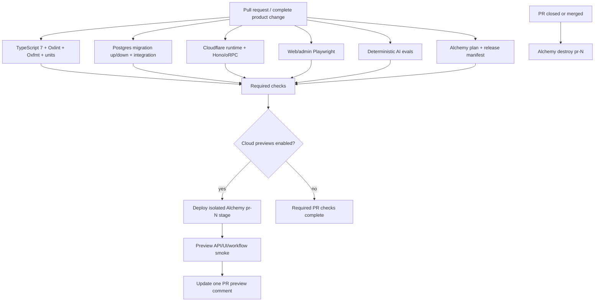

# CI/CD and preview environments

## Default

GitHub Actions is the workflow/control plane. Depot supplies managed GitHub Actions runner compute and accelerated caches. Alchemy builds, plans, deploys, isolates, versions, routes, and destroys infrastructure stages. Cloud PR previews are opt-in per repository; the normal pull-request pipeline remains complete without provisioning a cloud stage.

Every validated merge to `main` is automatically deployed to production. The exact release identity is the Git SHA. Changelogen creates occasional reviewed SemVer/changelog/GitHub Release checkpoints and never publishes workspace packages.

Workflow files remain standard GitHub Actions YAML. Depot is selected through runner labels, so GitHub-hosted or another compatible runner can replace it without redesigning the pipeline.

## Pull-request pipeline



The PR is one release unit. A migration, frontend change, backend change, infrastructure change, and safe flag default are validated together rather than promoted as unrelated pipelines.

## Pull-request jobs

Independent jobs run in parallel on Depot:

1. **Fast checks:** lockfile/workspace integrity, TypeScript 7 typecheck, type-aware Oxlint, Oxfmt check, units/domain tests, schema/flag/event tests, capability manifest/Effect Layer checks, generated-artifact drift.
2. **Database/release:** matching-version ephemeral Postgres, forward migration, new API/domain tests, safe down migration where claimed, previous-version fixture checks, and release-manifest validation.
3. **Cloudflare/API:** `workerd` Vitest integration for the Hono Worker, Better Auth, oRPC/OpenAPI, R2, KV, Queues, Durable Objects, and Workflow World cases.
4. **Browser:** customer and admin Playwright suites, including staff capability/impersonation/masking flows.
5. **AI fast evals:** deterministic/replay `vitest-evals` with no uncontrolled spend.
6. **Build/IaC:** production builds for `web`, `admin`, and `api`; Alchemy plan; bundle/source-map/binding checks.
7. **Generator fixtures:** representative `turbo gen` outputs typecheck/lint/test when generator templates change.

After required validation, deploy `pr-{number}` and run smoke tests only when the repository selects Alchemy previews. Post/update the preview comment only for that path.

## Release manifest

CI generates an immutable manifest for the candidate:

```text
gitSha
productVersion? 
webVersion / adminVersion / apiVersion
migrationRange + reversibilityClass
infrastructurePlanDigest + statefulChanges
requiredFlagDefaults
durableSchemaVersions
testAndEvalResultReferences
sourceMapAndSentryReleaseIds
```

Production deploy, observability, rollback, and admin tooling refer to this manifest rather than reconstructing a release from a moving branch.

## Resource policy when cloud previews are enabled

Alchemy stages isolate resources, but not every managed service is duplicated blindly.

| Resource | Enabled-preview default |
| --- | --- |
| web/admin/api Workers and assets | isolated stage resources |
| Queues/DLQs/KV/DO/Workflow World | isolated when integration behavior is exercised |
| R2 | isolated bucket or clearly prefixed disposable test bucket |
| PlanetScale | matching ephemeral Postgres for CI; enabled cloud previews receive an isolated migrated database/branch plus deterministic seeds |
| Polar/Bento/Sentry/PostHog/AI | sandbox/test projects or fake/disabled adapters; never production destinations |
| Domains | generated preview URLs; custom preview domains only when required |

Seed deterministic synthetic data. A configured sanitized-snapshot source may replace/precede seeds later, but raw production content is never the default. Preview emails go to capture/allowlisted recipients. Preview billing uses sandbox/fakes. Preview AI has strict budgets and test keys. PostHog capture is disabled or points to a non-production project.

## Opt-in preview lifecycle

- PR opened/synchronized/reopened: deploy/update `pr-{number}`.
- New commits cancel older in-progress work through a concurrency group.
- PR closed/merged: cleanup runs even if earlier jobs failed.
- A scheduled janitor detects expired/orphaned `pr-*` stages and alerts/destroys according to policy.
- Production-like stage names are guarded from generic cleanup/destruction.
- Stateful preview data is disposable unless briefly retained with expiry and owner.

## Main and continuous production delivery

Merging a validated PR triggers a clean `main` pipeline for the exact merge commit:

1. Re-run required deterministic checks from the immutable commit.
2. Run `release:check`, then load/verify the release manifest and Alchemy plan.
3. Acquire the database release lock.
4. Apply the tied Drizzle migration using privileged migration credentials.
5. Upload immutable green `web`, `admin`, and `api` versions with the Git SHA and no customer traffic.
6. Target green with production smoke tests using preview URLs/version overrides and a synthetic organization.
7. Validate migration state, bindings, health, Sentry/evlog version attribution, and defined release thresholds.
8. Cut traffic from blue to green, normally directly to 100 percent.
9. Run post-cutover customer/admin/API journeys and monitor thresholds.
10. Retain blue version IDs and the allowed database downgrade path through the release rollback window.

Canary traffic such as `1 → 10 → 50 → 100` is optional for unusually risky releases. Use Cloudflare version affinity so a user/organization does not bounce between incompatible UI/API versions. Every ramp step deploys the same immutable ref; never re-run against a moving `main` branch.

## Database and release rollback

Migrations declare one class: reversible, conditionally reversible, forward-only, or destructive. CI verifies every claimed safe downgrade. A rollback coordinator:

1. disables associated activation/kill-switch flags;
2. fences new-version background producers;
3. routes all application traffic to recorded blue versions;
4. applies the tested down migration only if classification and observed production writes still permit it;
5. runs previous-version smoke/data checks;
6. records the result and remediation when schema downgrade is refused.

If new writes make downgrade unsafe, keep the compatible expanded schema and roll back application code. Destructive/forward-only changes use staged compatibility or an explicit maintenance/write boundary. Backup restoration is disaster recovery, not routine rollback.

See [Release management](22-release-management.md).

## Production-targeted testing safety

The synthetic production organization is unmistakably marked and excluded from PostHog customer analytics, Polar billable usage, customer email delivery, and support KPIs. Tests use allowlisted/capture destinations, stable idempotency keys, bounded data, and cleanup. No production test can charge real payment methods, message arbitrary recipients, alter customer objects, or execute destructive staff actions.

Testing production is an additional confidence layer; it never substitutes for PR CI or any enabled isolated previews.

## Changelogen release checkpoints

A manually triggered `Prepare release` workflow:

1. runs `changelogen --bump` from the last product tag;
2. updates the root product version and `CHANGELOG.md` on a release branch;
3. opens a normal pull request;
4. passes the complete validation, optional-preview, and production path;
5. tags the merged commit and runs `changelogen gh release`.

Do not run `changelogen --release --push` directly against protected `main`. Conventional Commit-style squash PR titles drive the changelog/bump. Changesets, Release Please, semantic-release, and npm publication are not selected.

## Depot and Turbo caching

- Scope caches by lockfile, runtime, architecture, task inputs, and relevant configuration.
- Never cache secrets, decrypted config, mutable credentials, or production data.
- Shard independent CPU-heavy suites rather than one enormous sequential job.
- Use timeouts, cancellation, and concurrency limits for cost/runaway protection.
- Keep a fallback runner-label mapping for GitHub-hosted runners.
- Remote Turbo caching is optional and must use explicit environment inputs/outputs; local development does not require a hosted Turbo service.

Depot may use AWS internally. This architecture provisions no AWS account or resource.

## Secrets and untrusted pull requests

Forked/untrusted code receives no deploy, database, Polar, Bento, PostHog, Sentry, or AI secret. Use `pull_request` validation and do not execute untrusted checkout under dangerous `pull_request_target` privilege. Privileged preview deploys are gated to trusted actors/branches and use the exact validated commit.

Alchemy is the deployed secret-binding authority. Use least-privilege preview/production credentials and separate scopes/projects where practical. Secret masking is not a substitute for never printing secret-bearing objects.

## Generated artifacts and policy checks

CI checks drift for artifacts the project commits:

- TanStack route trees;
- Paraglide generated modules according to repository policy;
- Drizzle migrations/schema snapshots and reversibility metadata;
- OpenAPI documents/clients when promised;
- Cloudflare binding types;
- flag snapshot fixtures and event schemas;
- capability manifest/Layer/IaC fixtures, conservative limit schemas, and release-readiness policy;
- release manifest and generator snapshots.

Security tooling remains product-specific, but the pipeline has a clear stage for dependency, license, vulnerability, infrastructure-policy, and threat-model-derived tests.

## What not to do

- Do not maintain deployment-critical dashboard configuration outside Alchemy.
- Do not let previews or production tests use unbounded real customer/provider destinations.
- Do not deploy before required validation completes.
- Do not run all checks sequentially in one job.
- Do not run migrations during Worker startup or independently of the release manifest.
- Do not call arbitrary migrations reversible without downgrade/data-write tests.
- Do not direct-push Changelogen release commits around branch protection.
- Do not forget cleanup after failed PR jobs.
- Do not require or deploy a cloud preview when the repository's manifest disables previews.
- Do not assume Cloudflare code rollback restores connected stateful resources.

## Escape hatches

- Change Depot labels to GitHub-hosted or another compatible runner.
- Replace Alchemy deployment with SST/OpenTofu while retaining validation and release manifests.
- Add shared staging, approval gates, longer canaries, load/security tests, or two-person destructive approval as product risk grows.
- Replace Changelogen without changing SHA deployment identity or continuous delivery.

## Primary references

- [Depot GitHub Actions runners](https://depot.dev/docs/github-actions/overview)
- [Alchemy CI and PR previews](https://alchemy.run/environments/ci/)
- [Alchemy stages](https://alchemy.run/environments/stages/)
- [Alchemy gradual deployments](https://alchemy.run/cloudflare/compute/gradual-deployments/)
- [Cloudflare gradual deployments](https://developers.cloudflare.com/workers/versions-and-deployments/gradual-deployments/)
- [Cloudflare rollbacks](https://developers.cloudflare.com/workers/versions-and-deployments/rollbacks/)
- [Changelogen](https://github.com/unjs/changelogen)
- [Capability activation and release readiness](25-capability-activation-and-release-readiness.md)
