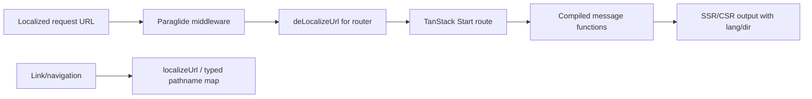
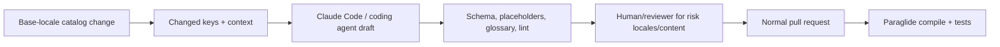

# Internationalization

## Decision

Use Paraglide JS as the service-free i18n default for both `apps/web` and `apps/admin`. Translation source files live in Git under `packages/i18n`, are reviewed like code, and compile into type-safe tree-shakeable message functions. Claude Code or another coding agent can draft and update translations, but humans and automated checks retain control of meaning, placeholders, and product terminology.

Paraglide is a good fit because it is compiler-oriented, framework-agnostic, Vite-friendly, and has a documented TanStack Start integration covering SSR, CSR, SSG, localized routing, middleware, and typed pathnames.

## Locale strategy

Use localized URLs as the primary locale signal for public pages, for example:

```text
/en/pricing
/fr/tarifs
```

Recommended resolution order:

1. locale in the URL;
2. explicit locale cookie/preference;
3. browser `Accept-Language`/preferred language;
4. configured base locale.

The URL is authoritative when present. A cookie must not make SSR render one language for a URL that claims another. Set `<html lang>` from Paraglide's current locale. Add `dir="rtl"` when the selected locale is right-to-left.

For private application routes where localized URLs add little product value, a project may keep stable nonlocalized paths while still resolving locale from preference. Make the route policy explicit; do not mix patterns accidentally.

## TanStack Start integration



Configure the Paraglide Vite plugin with the inlang project, generated output directory, message-module output, locale strategy, cookie name, and URL patterns. The TanStack router rewrite de-localizes incoming URLs for route matching and localizes outgoing URLs. The server entry wraps TanStack Start's handler in Paraglide middleware.

Compatibility note: Alchemy's TanStack deployment appends its own Cloudflare Vite plugin. Paraglide remains an ordinary Vite plugin, but plugin order and custom server entry composition must be tested with the exact TanStack Start/Alchemy versions in both frontend applications. Workflow World exports belong to `apps/api`; frontend i18n middleware must not become coupled to workflow runtime bindings.

## Message organization

Prefer stable semantic keys grouped by feature:

```text
auth.signIn.title
auth.signIn.submit
billing.creditBalance.label
project.delete.confirmation
errors.permissionDenied
```

Do not encode English sentences as keys for this stack. Stable keys make AI-assisted changes, terminology review, and refactoring safer. Co-locate catalogs by locale in the standard Paraglide/inlang layout and generate message modules.

Keep UI composition out of translations when possible. Use parameters for names, numbers, dates, and links with a documented markup/interpolation strategy. Avoid concatenating translated fragments; grammar and word order vary.

## Formatting

- Use locale-aware `Intl`/Paraglide formatting for numbers, percentages, dates, times, lists, and display names.
- Currency formatting uses both locale and explicit currency from billing/product data.
- Store timestamps in UTC and render in an explicit user/organization timezone.
- Pluralization uses message-format rules, never `count === 1` string concatenation.
- Do not translate identifiers, plan/product codes, or provider error strings directly.

## Product and provider errors

Server/domain errors expose stable codes and safe parameters. The client maps those codes to localized messages. Do not send prelocalized error prose from deep domain code. This preserves locale choice, public API stability, and observability grouping.

Better Auth/Polar/Bento provider errors are normalized into product codes where they are user-actionable. Unknown provider details are logged safely and rendered as a generic localized failure.

## AI-assisted translation workflow



Give the translation agent:

- changed base messages only;
- key descriptions and screenshot/component context where useful;
- approved terminology/glossary and tone;
- protected brand/product names;
- locale-specific style notes;
- strict instructions to preserve placeholders, markup tokens, and keys.

The agent updates translation files—not generated Paraglide output. Every change is a diff. High-risk legal, billing, security, authentication, medical, or compliance text receives qualified human review for target locales.

## CI checks

- Compile Paraglide from a clean checkout.
- Fail on missing/extra invalid keys according to the chosen completeness policy.
- Verify every locale preserves parameter names/types and markup tokens.
- Reject machine-edited generated files if repo policy regenerates them in build.
- Smoke-test localized routing and SSR hydration in at least base + one non-base locale.
- Run Playwright with a long-text locale and an RTL locale before claiming broad locale support.
- Check `<html lang>`, `dir`, localized canonical/alternate links for public SEO pages.
- Detect untranslated base-language copies with a reviewed allowlist, not a blind string-equality ban.

## Fallback and release policy

Choose per project whether missing translations block release or fall back to the base locale. Customer-facing production locales should normally require complete high-priority surfaces. Newly drafted locales can remain explicitly beta and fall back for low-risk gaps.

Translations are versioned with the application. Avoid runtime fetching from a translation service. Emergency copy fixes therefore follow the normal release path unless the project later adds a controlled content system.

## What not to do

- Do not let an agent auto-merge translations without placeholder/build checks.
- Do not localize by global mutable state that can leak across concurrent SSR requests.
- Do not rely only on browser language for indexable public URLs.
- Do not concatenate sentence fragments.
- Do not store provider/user-facing error prose as the application error contract.
- Do not commit secrets or customer data as “translation context.”
- Do not introduce a localization SaaS until collaboration scale proves it necessary.

## Escape hatches

- Paraglide builds on inlang's project/message ecosystem, allowing future editor/automation tooling without changing runtime architecture.
- A translation management service can later sync Git catalogs rather than becoming the runtime source of truth.
- i18next/FormatJS remains a migration option if component interpolation or a specific ecosystem integration becomes decisive; semantic keys and normalized locale routing reduce the move.

## Primary references

- [Paraglide JS for TanStack Start](https://paraglidejs.com/tanstack-start)
- [Paraglide JS comparison and compiler model](https://inlang.com/m/gerre34r/library-inlang-paraglideJs/comparison)
- [Paraglide JS strategy](https://paraglidejs.com/strategy)
- [Paraglide JS i18n routing](https://paraglidejs.com/i18n-routing)
