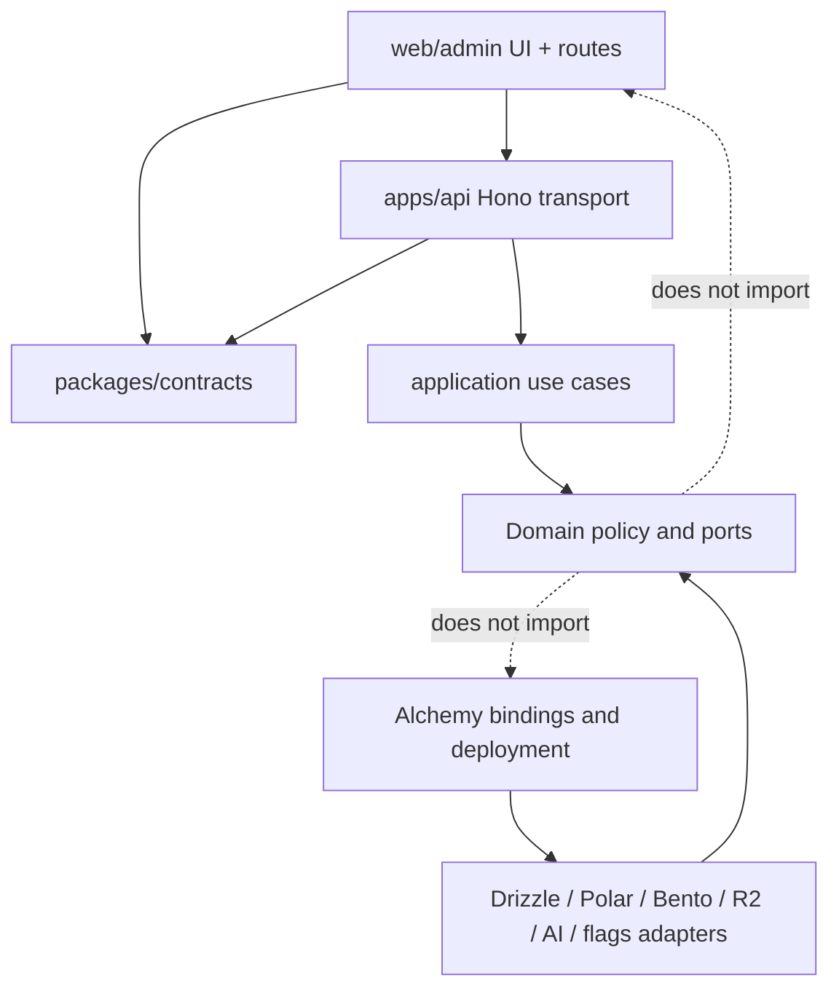

# Cross-cutting conventions

## Purpose

These rules keep the stack from becoming a collection of attractive libraries with overlapping responsibilities. They apply across frontend, API, domain, workflows, providers, and infrastructure.

## Dependency direction

Domain/application code names product concepts and depends on narrow ports. Adapters translate provider/runtime details. Infrastructure supplies adapters/bindings. The web/admin applications invoke one Hono API contract; neither imports API/application source. Hono adapters invoke use cases rather than implementing them.

## One owner per concern

| Concern | Owner |
| --- | --- |
| Repository/workspace | pnpm + Turborepo |
| Customer/staff routing and rendering | their TanStack Start applications |
| Backend runtime/routing | one Hono Worker (`apps/api`) |
| Remote client state | TanStack Query |
| Shared client-only state | Zustand, only where justified |
| API contract | oRPC + Zod |
| Domain execution semantics | Effect |
| SQL/schema/migrations | Drizzle |
| Product data/search | PlanetScale Postgres |
| Identity/session | Better Auth |
| Product tenant/membership | Better Auth Organization (`organization` shown as Team) |
| Authorization | Application policy |
| Durable orchestration | Workflow SDK |
| Buffering/fan-out | Cloudflare Queues |
| Object bytes | R2 |
| Email transport | Bento |
| AI provider abstraction | AI SDK registry |
| Product model policy | Capability configuration |
| Errors/traces/log backend | Sentry |
| Application logging vocabulary | evlog |
| Product analytics/replay | PostHog Cloud US through `packages/analytics` |
| Staff identity/impersonation primitive | Better Auth Admin |
| Admin capability policy and durable audit | application policy + PlanetScale ledger |
| Feature-flag authoring | PlanetScale |
| Normal flag read snapshot | KV |
| Billing commerce | Polar |
| Product entitlements | Application service/projection |
| Infrastructure/deployment | Alchemy |
| Structural capability selection | committed `product.config.ts` + Effect requirement graph |
| Release-readiness policy | committed readiness profile + CI `release:check` |
| Release identity/traffic coordinator | Git SHA manifest + Alchemy/Cloudflare versions |
| Human product versions/changelog | Changelogen |
| CI workflow | GitHub Actions |
| CI compute | Depot |
| Translation source | Git/inlang catalogs |
| Typecheck/lint/format | TypeScript 7 / type-aware Oxlint / Oxfmt |
| In-repo generators | native Turbo generators |

## Naming and IDs

- Use product-language names in public/internal contracts.
- Provider IDs live in adapter/projection tables and are never primary product identifiers.
- Generate stable opaque IDs in the application or database according to one project convention.
- Every external side effect has a business operation ID/idempotency key.
- Carry request, trace, workflow, queue, webhook, and product-operation correlation IDs where they cross boundaries.
- Do not use email addresses, filenames, model names, or provider references as stable keys.

## Error handling

External invalid data is a validation error. Expected product failure is a typed domain error. Transient dependency failure is classified and retried only when safe. Invariant violation is a defect captured in Sentry.

API clients receive stable error codes and safe parameters. Logs receive redacted operational detail. Users receive localized messages. These three representations are related but not identical.

## Idempotency and cross-system consistency

Postgres cannot atomically commit with R2, Polar, Bento, AI providers, or Queues. Use:

- unique operation/event ledgers;
- transactional outbox records where a database change must trigger an external effect;
- idempotent workflow steps/queue consumers;
- explicit intermediate states;
- reconciliation jobs against authoritative providers;
- compensation rather than imaginary distributed rollback.

Design duplicate delivery as routine, not exceptional.

## Time, money, and units

- Store timestamps in UTC and inject a clock in domain tests.
- Store money in integer minor units plus ISO currency unless a provider contract requires a different exact representation.
- Never use floating-point arithmetic for billing amounts.
- Name usage units explicitly (`tokens`, `generations`, `seconds`, `bytes`) and version conversion rules.
- Persist the pricing/policy version used for billable decisions when disputes/debugging may require it.

## Tenancy and authorization

- Better Auth organization is the mandatory product tenant; the UI calls it a Team. Individual user identities never own product records.
- Organization scope comes from authenticated server membership plus URL/resource lookup, not untrusted client claims or session active-organization state alone.
- Database queries, constraints, cache keys, billing/usage, AI/search, and object/file paths are organization-aware.
- Queue/workflow messages include stable organization context, then consumers re-authorize/reload sensitive state where necessary.
- A mutable Team name/slug is not identity. Canonical organization ID and immutable Team code preserve continuity; a DNS badge proves only domain control.
- Observability avoids leaking cross-organization data.
- Admin/support access is scoped, time-bounded when appropriate, and audited with the target organization.

See [Team tenancy and identity](26-team-tenancy-and-identity.md).

## Configuration and environments

- Effect Config handles server config; public client config is separately allowlisted and Zod-validated.
- A committed typed capability manifest selects structural services/resources; environment variables supply runtime values and secrets, not hidden infrastructure.
- Development, optional PR preview, optional staging, and production are explicit stages.
- Ordinary local development runs Postgres/Mailpit in Docker and Cloudflare primitives through local workerd/Miniflare without SaaS credentials.
- Safe non-service defaults are committed; generated local secrets and SaaS credentials are ignored.
- Alchemy is the only deployed resource/secret-binding authority.
- No environment silently shares stateful resources with production.
- Feature flags are not environment variables, and secrets are not flags.
- Validate required config on startup/deploy and fail with a clear non-secret error.
- Run capability graph/IaC consistency checks in CI and a configurable readiness gate before production.

## Versioning policy

This stack intentionally contains young components. Use exact or tightly controlled versions for Effect v4, Alchemy, Workflow SDK, the community Cloudflare World, and type-aware Oxlint. TypeScript 7 is the stable native baseline, but its configuration/tool integrations still receive compatibility tests. Group coupled upgrades, read release/migration notes, and run the full compatibility suite. Dependency-update automation is intentionally deferred.

Private workspace packages are direct-TypeScript implementation boundaries and are not published/versioned independently. Exact deployments use Git SHA/Cloudflare version IDs. Changelogen maintains reviewed product SemVer tags and `CHANGELOG.md` milestones without npm publishing.

Durable schemas need versions:

- queue messages;
- workflow inputs/step results that survive deployments;
- webhook normalization records;
- feature-flag snapshots;
- AI prompt/tool contracts;
- entitlement projection logic;
- file-processing/chunking/embedding pipelines.

Backward-compatible consumers precede producer upgrades. Destructive cleanup follows later.

## Complete release units

A pull request is the product change unit across `web`, `admin`, `api`, infrastructure, migrations, flag defaults, durable schemas, tests, and generated artifacts. Every validated merge to `main` becomes an immutable production deployment.

Production normally applies the tied migration, uploads zero-traffic green versions, runs synthetic/version-targeted tests, cuts to 100 percent, then verifies. Migrations declare reversible, conditionally reversible, forward-only, or destructive behavior. Rollback restores blue application versions and runs a down migration only while data-safe; stateful resources are never assumed to roll back with Worker code.

See [Release management](22-release-management.md).

## Logging and privacy

Use allowlists and structured fields. Never log secrets, session tokens, authorization headers, raw card/payment details, or unrestricted request bodies. Classify prompts, completions, documents, filenames, emails, and user-entered text before sending them to Sentry or eval artifacts.

Define retention and deletion for Postgres, R2, Sentry, Polar, Bento, and AI providers. “Managed service” does not remove the product's privacy obligations.

## Security baseline and launch completion

Every instantiation receives predictable application controls: secure headers/CSP baseline, same-origin/trusted-origin and CSRF policy, secure cookie defaults, bounded bodies, safe errors/redaction, webhook verification hooks, and authentication throttling interfaces. Disabling one requires a named reviewed override. No universal WAF/bot/provider suite is locked.

Before each product launches, complete the configured readiness profile, produce a threat model, and select/test remaining controls for:

- authentication/session hardening;
- authorization and organization isolation;
- CSRF, CORS, origin and webhook signature handling;
- rate limiting, quotas, bot/credential-stuffing defense;
- file upload/parser safety;
- AI prompt injection, tool safety, exfiltration, cost/runaway limits;
- billing fraud, replay, usage tampering, webhook duplication;
- dependency/supply-chain and secret handling;
- security headers, CSP, XSS/HTML injection, SSRF;
- backup/restore, incident response, audit, deletion/export.

Put security tests and policy checks into the existing test/CI layers rather than creating a parallel unowned process.

See [Capability activation and release readiness](25-capability-activation-and-release-readiness.md).

## Caching

The selected model is tiered and opt-in: TanStack Query for browser server state, Effect Cache for isolate-local lookup/deduplication, Cloudflare Cache API for explicitly safe HTTP representations, KV for eventually consistent global snapshots, and Postgres/Durable Objects for correctness-sensitive authority/coordination.

There is no Redis service and no universal `packages/cache` abstraction initially. Do not cache authorization, strict credits, or kill-switch decisions without an explicit consistency budget. Prefer bounded TTLs and versioned keys; invalidation delivery is never the correctness mechanism. See [Caching](23-caching.md).

## Realtime

Realtime was not selected. Prefer SSE/streaming for one-way progress and AI output. Introduce WebSockets/Durable Objects for presence/collaboration only when a project requires coordinated state. Do not make the Workflow World's WebSocket internals the general application realtime platform.

## Analytics and product events

PostHog Cloud US owns product analytics and selective masked session replay. `packages/analytics` defines typed semantic events, schemas, shared properties, and browser/Hono/no-op adapters. Hono emits authoritative outcomes; browser capture owns navigation/interaction context. Broad autocapture is minimized, sensitive content is excluded, and staff/impersonation activity never pollutes customer metrics.

PostHog feature flags remain disabled. Custom OpenFeature evaluation, Sentry/evlog operational telemetry, Polar usage, and the Postgres admin audit ledger retain their separate ownership. See [Product analytics](21-product-analytics.md).

## Decision test for adding technology

Before adding a service/library, answer:

1. Which measured problem does it solve?
2. Which existing owner does it replace or complement?
3. What is its authoritative state?
4. What is the application-facing boundary?
5. How is it tested locally and in CI?
6. What secrets/data leave the system?
7. What happens during outage, duplicate delivery, or partial failure?
8. What is the migration/escape path?
9. Can the project delete an existing component instead?
10. Can it remain an absent capability until a feature actually requires it?

If the new tool overlaps an existing owner without a crisp boundary, do not add it.

## Global anti-patterns

- Provider SDKs imported throughout product code.
- Optional SDK presence treated as permission to use an unprovisioned capability.
- Environment variables used as an untyped service locator or hidden IaC switch.
- Personal product tenants beside the mandatory Better Auth organization model.
- Server data copied into multiple state stores.
- Raw subscription status used as authorization.
- Queue messages treated as exactly once.
- Model names hardcoded in features.
- Infrastructure code containing business logic.
- Public APIs exposing database/provider objects.
- Logs used as a durable business ledger.
- Flags used as permissions or billing entitlements.
- Automatic retries without idempotency and cost analysis.
- Beta dependency upgrades merged independently without integration tests.
- “Temporary” preview/test paths connected to production data or providers.
- Backend/domain logic implemented separately in either TanStack Start application.
- Applications importing one another or shared packages importing `apps/api`.
- Direct PostHog calls scattered through features or PostHog flags enabled beside custom flags.
- Migrations executed during Worker startup or called reversible without downgrade/data tests.
- A generic cache interface that hides incompatible consistency semantics.
- Release commits pushed directly around the validated pull-request path.

## Future escape-hatch map

| Current default | Escape hatch |
| --- | --- |
| TanStack Start web/admin | Other Vite/React host while preserving Hono/oRPC contracts |
| Hono Worker backend | Hono Lambda/Node/other runtime entrypoint while preserving use cases |
| oRPC | Conventional OpenAPI/other contract layer mounted in Hono using Zod schemas |
| Effect v4 | Plain async services behind the same ports |
| PlanetScale | Another PostgreSQL provider |
| Workflow Cloudflare World | Another Workflow SDK World |
| Cloudflare Queues | SQS/another at-least-once queue through `JobQueue` |
| R2 | S3-compatible storage through `ObjectStore` |
| Bento | Resend/Postmark/Cloudflare Email adapter |
| Vercel AI Gateway | Direct providers/another gateway via registry |
| Sentry | OTLP/log drains and another observability backend |
| PostHog | Another event backend/warehouse through typed semantic events |
| Custom flags | Another OpenFeature provider |
| Polar | Stripe/Dodo/Paddle/enterprise adapter plus local entitlements |
| Alchemy | SST, then OpenTofu for broader/boring infrastructure |
| Depot | GitHub-hosted or Blacksmith runner labels |
| Paraglide | Git-synced TMS or another runtime using stable semantic keys |
| Changelogen | Another changelog/release-record tool; SHA deployments remain unchanged |
| Turbo generators | Ordinary files or a later UnJS-based organization CLI |

AWS is the reference escape target, not a maintained second stack. Contract tests and narrow product capability ports make an incremental R2→S3, Queues→SQS, Worker→Lambda, or World replacement possible without building a generic multi-cloud framework today.
