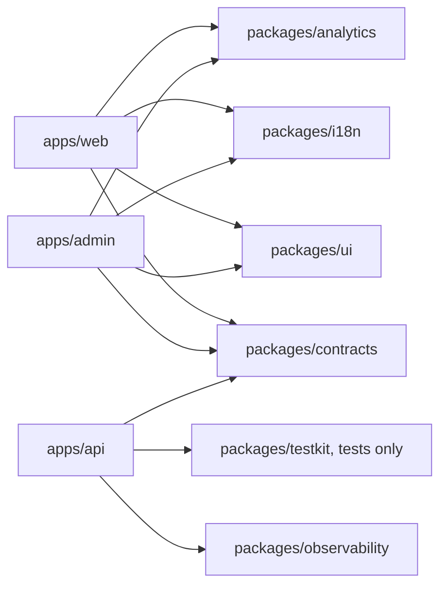

# Monorepo, toolchain, and local development

## Default

Each repository contains one business product. It is a private pnpm workspace coordinated by Turborepo. The customer application, staff application, and backend are separate deployable applications; shared packages are implementation units, not separately published products.

The default toolchain is TypeScript 7 for typechecking, Oxlint with `oxlint-tsgolint` for type-aware linting, and Oxfmt for formatting. Package update automation is deliberately deferred.

## Repository map

```text
apps/
  web/                         # customer TanStack Start application
  admin/                       # staff-only TanStack Start application
  api/                         # one Hono Cloudflare Worker backend
    src/
      http/                    # Hono/oRPC/auth/webhook transport adapters
      modules/                 # product-owned vertical backend modules
      workflows/               # Workflow SDK definitions and triggers
      steps/                   # reusable durable workflow steps
      queues/                  # Cloudflare Queue consumers
      scheduled/               # cron entrypoints
      platform/
        ports/                 # product capability Effect services
        cloudflare/            # bindings and current provider adapters
packages/
  contracts/                   # client-safe Zod/oRPC contracts and error codes
  ui/                          # source-owned shared React components and tokens
  i18n/                        # Paraglide catalogs, config, and generated boundary
  observability/               # shared telemetry vocabulary and safe helpers
  analytics/                   # typed semantic product events and adapters
  testkit/                     # fixtures, fakes, factories, and environment helpers
  typescript-config/           # shared TypeScript configuration presets
turbo/
  generators/                  # native Turbo vertical-slice generators
infra/                         # Alchemy resource modules
alchemy.run.ts                 # infrastructure/deployment entrypoint
product.config.ts              # typed capabilities, security/readiness, previews; no secrets
compose.yaml                   # portable local Postgres and Mailpit services
pnpm-workspace.yaml
turbo.json
```

`apps/web` and `apps/admin` are products from a deployment and user-experience perspective. `apps/api` is the only backend product. `packages/*` are private shared code boundaries; they are not independently versioned or published.

## Dependency direction



Rules:

- An application never imports another application's source files.
- Client-safe packages never import `apps/api`, provider SDKs, secrets, database code, or Cloudflare bindings.
- Backend feature modules remain under `apps/api/src/modules/*` until a second real runtime consumer justifies extraction.
- Packages expose deliberate export maps; consumers do not reach into internal file paths.
- Shared packages use direct TypeScript source during development. There is no internal package build/publish ceremony unless a tool specifically requires emitted files.
- `packages/ui` may depend on browser-safe `contracts` and `i18n`; it does not perform data access.

## Tool ownership

| Concern | Owner | Convention |
| --- | --- | --- |
| Dependency installation/linking | pnpm | One root lockfile; workspace protocol for internal packages |
| Task graph and caching | Turborepo | Package scripts remain independently runnable |
| Typechecking | TypeScript 7 | Project-scoped configs extending `packages/typescript-config` |
| Fast and type-aware linting | Oxlint + `oxlint-tsgolint` | Root type-aware configuration; exceptions are narrow and explained |
| Formatting | Oxfmt | One repository formatter; CI checks rather than rewrites |
| Code generation | `turbo gen` | Exposed as `pnpm generate` |
| Releases/changelog | Changelogen | Repository product version only; no package publication |

Keep typechecking and linting conceptually separate even if Oxlint can surface compiler diagnostics. `pnpm typecheck` remains the authoritative compiler gate; `pnpm lint` owns correctness/style rules. This makes failures and editor behavior predictable.

Type-aware Oxlint uses `typescript-go` and requires TypeScript 7-compatible configuration. Root `tsconfig` should contain `files: []`; each app/package defines a bounded project so one accidental `**/*` include does not turn the entire monorepo into one expensive program.

## Turbo task graph

Root commands are stable product workflows:

```text
pnpm dev
pnpm dev:cloud
pnpm build
pnpm typecheck
pnpm lint
pnpm format:check
pnpm test
pnpm test:e2e
pnpm generate
pnpm capabilities:check
pnpm release:check
```

Turbo expresses dependencies such as `build` depending on dependency builds and `test` depending on generated artifacts where needed. Persistent `dev` tasks are not cached. Tasks declare their environment inputs and outputs so secrets never enter a remote-cache key or artifact.

Use Turbo filters for focused work, but keep every package script runnable directly. Turborepo is an orchestrator, not the only way to understand or execute a package.

## Fully local default

`pnpm dev` must work without accounts or SaaS credentials:

1. Verify supported Node, pnpm, and a Docker-compatible CLI.
2. Start matching-version PostgreSQL and Mailpit from `compose.yaml`.
3. Wait for health checks.
4. Apply Drizzle migrations and run an idempotent seed.
5. Start the API in local workerd with only the selected capability emulators/fakes (for example KV, R2, Queues, Durable Objects, and the Workflow World when present).
6. Start the customer and admin TanStack Start applications through Turbo.
7. Use deterministic fakes or no-op adapters for Polar, Bento delivery, PostHog, Sentry, and paid AI providers.

Supporting commands:

| Command | Behavior |
| --- | --- |
| `pnpm dev:services` | Start Postgres and Mailpit only |
| `pnpm dev:apps` | Start apps against already-running services |
| `pnpm dev:down` | Stop local services while preserving volumes |
| `pnpm dev:reset` | Explicitly recreate disposable local data and reseed |
| `pnpm dev:cloud` | Create/select a personal Alchemy stage and use real isolated Cloudflare resources |

Services may remain running when app processes stop, making restarts fast. `dev:reset` is intentionally explicit because it deletes local disposable data.

## Docker portability

Docker CLI and Compose syntax are the documented standard. Use official OCI images and ordinary volumes, networks, and health checks. The workflow must not require Docker Desktop, a Docker Hub login, Docker Cloud, proprietary extensions, or a hosted Docker service.

Colima, OrbStack, Podman compatibility layers, and similar engines may work, but the project supports Docker semantics rather than every alternative independently.

## Configuration and secrets

Commit safe, non-secret defaults:

```text
product.config.ts
.env.example
.env.development
apps/api/.dev.vars.example
compose.yaml
alchemy.run.ts
```

Ignore machine-specific and secret-bearing files:

```text
.env.local
.dev.vars.local
apps/api/.dev.vars
```

Bootstrap generates local-only auth/encryption secrets into an ignored file. SaaS tokens are never required for ordinary development and are never committed. Encrypted secrets in Git are not the default even for private repositories; they create key-management and accidental-decryption risk without improving this architecture.

`product.config.ts` is the reviewed structural manifest. It may select absent/configured/enabled capabilities, conservative limits, security preset, readiness objectives, and preview policy. It never contains secret values. Effect Config validates runtime values; Alchemy turns selected structural capabilities into deployed resources/bindings.

Alchemy declares every deployed secret name and binding. Actual preview/production values live in the stage/provider secret store and enter CI through scoped credentials. There is one deployed secret authority—not a competing collection of Wrangler files, dashboard values, and encrypted repository blobs.

## What not to do

- Do not create a repository per frontend/backend layer for one product.
- Do not call shared packages separate products or publish them preemptively.
- Do not put backend domain modules in `packages/*` merely to make the tree look symmetrical.
- Do not install both Prettier and Oxfmt as competing formatters.
- Do not make normal local development depend on PlanetScale, Polar, PostHog, Sentry, Bento, or paid model credentials.
- Do not provision every optional capability merely because its adapter exists in the repository.
- Do not hide destructive local reset behavior inside `pnpm dev`.

## Escape hatches

The package boundaries allow a future application or backend to move to another repository if team/release independence becomes real. pnpm scripts remain portable to another task runner. Docker Compose services can move to Dev Containers or a managed development environment. Shared packages can gain build artifacts and publishing only when an external consumer exists.

## Primary references

- [pnpm workspaces](https://pnpm.io/workspaces)
- [Turborepo](https://turborepo.dev/docs)
- [Turborepo code generation](https://turborepo.dev/docs/guides/generating-code)
- [Oxlint type-aware linting](https://oxc.rs/docs/guide/usage/linter/type-aware.html)
- [TypeScript 7](https://devblogs.microsoft.com/typescript/announcing-typescript-7-0/)
- [Alchemy local development](https://alchemy.run/environments/local-development/)
- [Cloudflare local development](https://developers.cloudflare.com/workers/local-development/)
- [Capability activation and release readiness](25-capability-activation-and-release-readiness.md)
