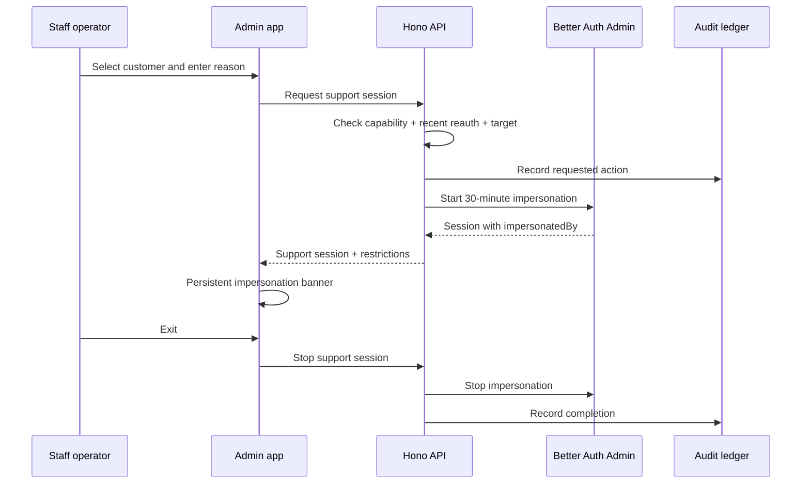

# Admin and support operations

## Default

`apps/admin` is a staff-only TanStack Start application for internal operators. It uses the same Hono API and Better Auth identity system as the customer application, but every admin route and procedure requires explicit staff capability checks.

Better Auth's Admin plugin supplies the modern authentication primitives: role/permission support, user administration, impersonation, impersonation duration, protection against impersonating administrators, and `session.impersonatedBy`. The application supplies product-specific capabilities, support-session policy, reauthentication, data masking, operational workflows, and the authoritative audit ledger.

## Operations surface

The initial console is unified rather than split into multiple vendor dashboards:

- users, organizations, memberships, sessions, and security posture;
- subscriptions, entitlements, credits, metered usage, and reconciliation status;
- workflows, queue deliveries, dead letters, and retry/replay operations;
- files and processing state without exposing object-storage internals unnecessarily;
- email delivery history and provider deep links;
- AI usage, model route, cost, and safety/eval metadata;
- feature-flag drafts, publish history, and kill switches;
- audit search and incident correlation.

Postgres projections are the normal read model. A page does not synchronously assemble itself from Polar, Bento, Sentry, PostHog, and Cloudflare APIs. Provider deep links and explicit refresh/reconcile actions handle cases where current external state is required.

## Staff identity and capabilities

Customers and staff use one Better Auth installation and user table. Staff status is a privileged role/capability assignment, not a parallel identity database. The admin origin rejects authenticated non-staff users before rendering private application content.

Role presets are conveniences:

- **Support:** customer lookup, masked reads, time-bounded impersonation, safe operational actions.
- **Operations:** support capabilities plus workflow/queue/reconciliation operations and selected flag management.
- **Owner:** role administration and the small set of highly sensitive/destructive capabilities.

Authorization evaluates capabilities, not hardcoded role names. A role is a reviewed bundle that can evolve without rewriting each procedure.

## Strong staff authentication

Staff accounts require strong authentication. Passkeys/WebAuthn are preferred; MFA with recovery codes is the fallback. Recent reauthentication is mandatory before impersonation, role/capability changes, credential resets, destructive operations, or sensitive data reveals.

The server—not the UI—enforces staff status, capability, recent-auth time, target restrictions, and organization scope on every operation.

## Support sessions and impersonation

Policy:

- Maximum duration is 30 minutes; extension requires a new reason and authorization check.
- Staff users cannot be impersonated.
- The UI always shows the real operator, effective user, target organization/Team code, remaining time, and an obvious exit action.
- Sensitive and destructive capabilities remain blocked while impersonating unless a narrowly defined policy explicitly allows them.
- Every support session records a reason before it starts.
- Request context carries both the real actor and effective user; logs must never collapse them into one identity.

## Risk levels

| Level | Examples | Required controls |
| --- | --- | --- |
| Read | masked profile, subscription projection, workflow status | capability + audit |
| Operational | resend safe email, retry workflow, refresh provider projection | confirmation + capability + audit |
| Sensitive | reveal protected field, impersonate, revoke sessions, adjust entitlement | reason + recent reauth + detailed audit |
| Destructive | delete product data, terminate access, irreversible billing correction | typed confirmation + recent reauth + durable workflow/cancel window |

Two-person approval is not the default for a small team. The capability model and durable action records leave a clean path to add it for selected operations later.

## Data masking

Sensitive customer data is masked by default. A reveal requires a dedicated capability, a reason, and an audit event. Prefer task-specific views over generic database explorers. Do not make raw payment-card data available; Polar as Merchant of Record owns that compliance boundary.

Raw AI prompts/completions, document content, authentication secrets, API keys, recovery codes, and unrestricted provider payloads are not normal admin fields. Expose safe metadata and narrowly approved reveal paths only when the support use case justifies them.

## Authoritative audit ledger

The audit ledger is append-only product data in PlanetScale Postgres. Sentry, evlog, PostHog, and provider logs may reference an audit record, but none replaces it.

Each record includes:

- immutable event ID and timestamp;
- real actor, effective user, staff session, role/capability, and recent-auth evidence;
- action name, target type/ID, organization/Team code, and required reason;
- redacted before/after or command parameters;
- request, trace, workflow, provider event, and idempotency IDs;
- result, error class, reversal/compensation link, and related audit IDs.

Updates are modeled as new events. Retention and access are stricter than ordinary operational logs.

## Operational actions

Long-running or destructive actions start Workflow SDK runs from Hono. The admin page shows accepted status and follows the durable operation. It does not keep an HTTP request open while deleting objects, replaying large queues, backfilling entitlements, or rebuilding search data.

Every action is idempotent, bounded, observable, and has an explicit retry/compensation policy. “Run arbitrary SQL” and “invoke arbitrary provider method” are not product capabilities.

## What not to do

- Do not build admin behavior as hidden customer routes with an `isAdmin` conditional.
- Do not trust a staff-looking UI to enforce permissions.
- Do not impersonate staff or allow indefinite impersonation.
- Do not synchronously fan out to every SaaS provider to render a page.
- Do not use Sentry or evlog as the durable audit ledger.
- Do not adopt React Admin/Refine as a second application framework unless CRUD scale later outweighs the shared TanStack architecture.

## Escape hatches

The capability and audit model can add approval workflows, just-in-time access, enterprise identity, SCIM, or a dedicated policy engine. Provider projections can move to specialized operational stores. The admin frontend can be replaced without changing Hono admin contracts or audit semantics.

## Primary references

- [Better Auth Admin plugin](https://better-auth.com/docs/plugins/admin)
- [Better Auth passkey plugin](https://better-auth.com/docs/plugins/passkey)
- [Better Auth two-factor authentication](https://better-auth.com/docs/plugins/2fa)
- [Better Auth Hono integration](https://better-auth.com/docs/integrations/hono)
