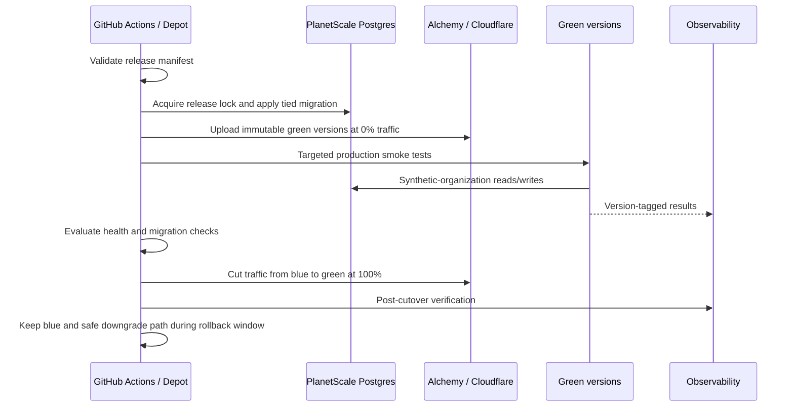

# Release management

## Default

Every validated merge to `main` is an immutable production deployment. The exact deployment identity is the Git SHA, not a package version. A pull request is the complete product release unit across customer frontend, admin frontend, Hono API, infrastructure, database migrations, and initial feature-flag state.

Changelogen produces reviewable human release checkpoints: SemVer, `CHANGELOG.md`, Git tag, and GitHub Release. It never publishes the private workspace packages.

## Two identities

| Identity | Purpose |
| --- | --- |
| Git SHA / Cloudflare version IDs | Exact deployed code, incident correlation, smoke targeting, rollback |
| Product SemVer tag | Human milestone, changelog, support communication, product history |

Continuous delivery does not create a SemVer tag for every merge. Ordinary merges deploy immediately. A manually triggered `Prepare release` workflow uses Changelogen to infer the bump from Conventional Commit-style squash titles, update the root product version and changelog, and open a normal release PR. Merging that PR deploys like any other validated change; a follow-up workflow tags that exact commit and syncs the GitHub Release.

## Release manifest

CI emits an immutable manifest for each candidate containing:

- Git SHA and optional product version;
- `web`, `admin`, and `api` artifact/version identifiers;
- database migration range and reversibility classification;
- infrastructure plan digest and stateful resource changes;
- flag keys/defaults required for safe inactive behavior;
- schema versions for queues, workflows, webhooks, and public contracts;
- test/eval results and source-map identifiers.

Sentry releases, evlog records, PostHog events, admin audits, migrations, workflows, and support tools carry the Git SHA/release ID so one incident view can reconstruct the active change set.

## Pull-request validation

The release candidate is tested as one unit:

1. Typecheck, type-aware lint, formatting, units, deterministic evals, and generated-artifact checks.
2. Apply all forward migrations to matching-version ephemeral Postgres.
3. Run API/domain/SQL/runtime tests against the upgraded schema.
4. For reversible migrations, apply down migrations and verify the previous application/schema fixture.
5. Re-apply forward migrations to prove round-trip determinism where practical.
6. Build all three applications and the Alchemy infrastructure plan.
7. Deploy an isolated PR stage and run Playwright/API/workflow smoke tests.

A migration, flag default, or infrastructure change cannot merge merely because its individual package passes.

## Production blue/green flow

Alchemy exposes Cloudflare immutable versions, preview URLs, version overrides, traffic allocation, and exact-code rollback. Green is uploaded with no customer traffic and exercised against production dependencies using a synthetic production organization and tightly controlled side effects. Normal releases then switch directly from zero to 100 percent. A `1 → 10 → 50 → 100` canary is reserved for unusually risky changes, with user/organization version affinity where required.

Multiple Cloudflare Workers and PostgreSQL do not share a literal cross-system transaction. The release coordinator makes the process observable and recoverable; compatibility rules and flags cover the brief transition boundary.

## Testing in production

Testing in production means:

- version-targeted health and API tests before traffic;
- a dedicated synthetic organization/customer excluded from analytics and billing;
- email allowlists/capture destinations and non-chargeable billing fixtures;
- dark execution for selected workflows and model routes;
- optional staff/cohort canaries with version affinity;
- automated post-cutover journeys and metric/error comparison;
- immediate flag disable or code rollback on defined thresholds.

It does not mean skipping CI, any enabled previews, schema rehearsal, or destructive-side-effect controls.

## Feature activation

Deployment and activation are separate. New risky behavior ships disabled or narrowly targeted behind the custom flag system. Code must define a safe default if no snapshot is available. Ordinary flags use KV snapshots; true emergency controls use the stronger kill-switch path.

Flags do not make incompatible database changes safe by themselves. The inactive code path and currently serving blue version must still tolerate the production schema during cutover.

## Migration classifications

Every release migration declares one class:

### Reversible

Forward and down migrations are tested. New writes remain representable by the prior schema, or the down migration transforms them safely. Automatic full-release rollback is allowed within the declared window.

### Conditionally reversible

The schema can be downgraded only until a specific new write or activation occurs. The release manifest defines that condition and the coordinator refuses automatic downgrade after it is crossed.

### Forward-only

Dropping back would lose or misinterpret data. Retain the old shape, deploy compatibility code, activate behind a flag, and complete cleanup in a later release. Application code can roll back while the expanded schema remains.

### Destructive

The change removes or irreversibly transforms authoritative data. Require an explicit staged transition, verified backup/restore plan, or maintenance/write boundary. It is never presented as automatically rollbackable.

Postgres branches are useful rehearsal environments, but PlanetScale Postgres branches are isolated and do not continuously replicate production writes. They are not a synchronized green database.

## Rollback coordinator

Rollback is one operation against the release manifest:

1. Disable associated activation/kill-switch flags.
2. Route all traffic to the recorded blue versions.
3. Stop or fence new-version background producers.
4. Apply the tested down migration only when its classification and observed writes still permit it.
5. Run previous-version smoke and data-integrity checks.
6. Record result, skipped database downgrade reason, and follow-up remediation.

If new writes make schema downgrade unsafe, keep the compatible expanded schema and roll back application code. Restoring a database backup is disaster recovery, not normal rollback, because it discards writes after the restore point.

## Changelogen workflow

Use `changelogen --bump` on a generated release branch/PR. Do not run `changelogen --release --push` directly against protected `main`; that would bypass the normal review/validation path. After merge, create the tag for the version already present in the root `package.json`, then use `changelogen gh release` to synchronize release notes.

No Changesets, Release Please, semantic-release, or npm publication is part of the default stack.

## What not to do

- Do not equate a SemVer label with an exact deployment; retain SHA/version IDs.
- Do not run migrations during Worker startup or separately from the release coordinator.
- Do not claim arbitrary data migrations are automatically reversible.
- Do not direct-push release commits around branch protection.
- Do not test production with real customer accounts, unrestricted email, or billable side effects.
- Do not ramp incompatible blue and green versions against one shared schema.

## Escape hatches

High-risk products can add a shared staging gate, longer canaries, manual production approval, write quiescence, or two-person destructive approval. A future database platform with synchronized branching may improve database blue/green behavior, but the migration classification remains useful. Another changelog tool can replace Changelogen without changing deployment identity or release manifests.

## Primary references

- [Changelogen](https://github.com/unjs/changelogen)
- [Alchemy gradual deployments](https://alchemy.run/cloudflare/compute/gradual-deployments/)
- [Cloudflare gradual deployments](https://developers.cloudflare.com/workers/versions-and-deployments/gradual-deployments/)
- [Cloudflare rollbacks](https://developers.cloudflare.com/workers/versions-and-deployments/rollbacks/)
- [Cloudflare version overrides](https://developers.cloudflare.com/workers/versions-and-deployments/version-overrides/)
- [PlanetScale Postgres branching](https://planetscale.com/docs/postgres/branching)
