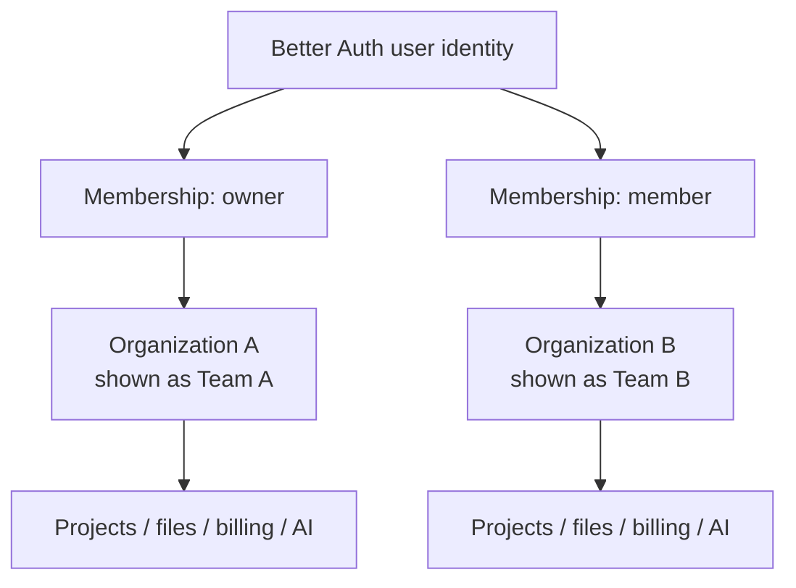
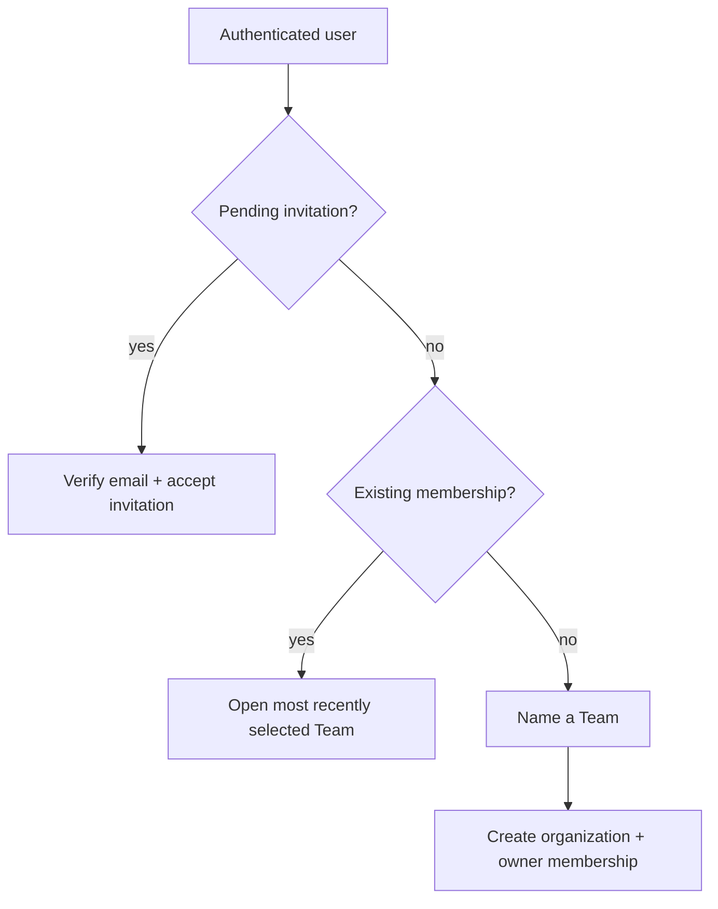

# Team tenancy and identity

## Default

Every product is organization-tenant-first. Better Auth's Organization plugin owns organizations, memberships, invitations, active-organization session state, and the base `owner`/`admin`/`member` role model. The product calls an organization a **Team** in customer-facing copy.

A Better Auth user is a login identity, never a personal product tenant. There are no personal projects, files, subscriptions, usage balances, feature assignments, AI conversations, or workspaces. Every product record belongs to an organization.

Do not enable Better Auth's optional nested Teams initially. If a future product needs departments or subgroups, that feature can sit inside the top-level organization without changing the tenant boundary.

## Identity model



Internally use Better Auth's canonical terms and fields—`organization`, `organizationId`, `member`, `activeOrganizationId`. UI copy uses Team, Team members, Team settings, and Switch team. This avoids translating identifiers through a parallel tenancy schema while retaining friendly product language.

## Organization identity fields

| Field | Mutability | Uniqueness | Purpose |
| --- | --- | --- | --- |
| `id` | immutable | database/global | opaque canonical Better Auth identity |
| `name` | mutable | not required | customer-facing Team name |
| `slug` | separately mutable | global | stable URL/navigation key |
| `publicCode` | immutable | global | human-verifiable Team reference |
| verified domains | revocable | one active owner per domain policy | proof of domain control |

Example:

```text
Name: Acme
URL: /t/acme-7k4p
Team code: TEAM-7K4P-9D2M
Domain ownership verified: acme.com
```

Better Auth supports additional organization fields; use that extension for the immutable random `publicCode`. Do not expose a sequential database identifier. Generate the initial slug from the normalized name plus a short random suffix so common names do not collide or become a high-value handle-squatting race.

## Signup and onboarding



An invited user joins the inviting Team and does not receive an extra personal Team. An unaffiliated open signup must name a Team during onboarding and becomes its owner. A user with no memberships cannot access product data; they return to invitation/team-creation onboarding.

Organization provisioning creates or schedules only selected capabilities: starter records, flag defaults, billing/usage projection, analytics group, and other configured organization state. External side effects are idempotent and may run through Workflow SDK rather than making organization creation a fragile cross-provider transaction.

## Rename, slug, and stable identity

Renaming the display name does not automatically change the slug or `publicCode`:

```text
Before: name Acme, slug acme-7k4p
After:  name Acme Research, slug acme-7k4p
```

Owners may change a slug separately. Require recent reauthentication, collision/reserved-name checks, explicit confirmation, and an audit event. Preserve redirects/aliases from previous slugs and never reassign an old slug to a different organization. Old invitations, bookmarks, audit references, and support records must not silently point to a new tenant.

The immutable `publicCode` appears in Team settings, invitation review, billing/support screens, and administrative search. It lets a user compare interactions even after a display-name or slug change.

## Active organization and URLs

Customer routes include the intended organization explicitly:

```text
/t/:organizationSlug/projects
/t/:organizationSlug/settings
/t/:organizationSlug/billing
```

The Hono boundary resolves the slug, authenticates the user, loads the membership, and constructs trusted organization context. Better Auth's `activeOrganizationId` records the recent selection for redirects and UI convenience; it is not the sole authorization input. Explicit URLs remain stable across multiple tabs and are shareable without mutating session-global authorization state.

```ts
interface OrganizationContext {
  organizationId: OrganizationId
  memberId: MemberId
  userId: UserId
  roles: ReadonlySet<OrganizationRole>
}
```

Client-provided `organizationId` values are never trusted by themselves. Use server-derived context and resource lookup for every operation.

## Isolation rules

- Every organization-owned table carries `organizationId`; organization-local uniqueness and hot-path indexes include it.
- Repositories/use cases require `OrganizationContext` rather than accepting an arbitrary untrusted organization identifier.
- R2 metadata and opaque object keys preserve organization ownership.
- Queue/workflow payloads carry stable `organizationId`; consumers reload sensitive policy/membership where required.
- TanStack Query keys and client caches include organization scope and are cleared/partitioned on switches.
- Feature evaluation uses trusted opaque organization context.
- Polar customers, subscriptions, usage, credits, and entitlements belong to the organization by default.
- PostHog uses the organization as its group identity while excluding staff/impersonation activity.
- AI conversations, budgets, retrieval filters, file chunks, and model-policy decisions remain organization-scoped.
- Support/impersonation logs record both the real operator and target organization.
- No analytics property, URL slug, email domain, or billing provider ID substitutes for the canonical organization ID.

Database constraints and tests are defense in depth. Application authorization remains mandatory even if a product later adopts PostgreSQL row-level security.

## Roles and membership lifecycle

Start with Better Auth's static roles:

- `owner`: full organization control and ownership transfer/deletion;
- `admin`: member/settings/product administration without final ownership authority;
- `member`: ordinary product access through application permissions.

Dynamic organization-defined roles remain disabled initially. Application policy can refine product capabilities without building a role-authoring product.

Invariants:

- every organization has at least one owner;
- the final owner cannot leave without transferring ownership or deleting the organization;
- removal/suspension invalidates access and re-evaluates sessions/caches promptly;
- ownership, role, invitation, and membership changes are audited;
- organization deletion follows the configured retention/deletion workflow rather than a blind database cascade.

## Invitation safety

Enable Better Auth's strict invitation posture:

```ts
organization({
  requireEmailVerificationOnInvitation: true,
  invitationExpiresIn: 60 * 60 * 48,
})
```

Use opaque invitation IDs. The authenticated, verified session email must match the recipient. Invitations are single-use, expire after 48 hours, and display the proposed role before acceptance. A reissued invitation cancels/invalidates the earlier token according to policy. Acceptance rechecks that the inviter still has permission and that the organization remains active.

The recipient can ignore the email link, open the application through a known URL, sign in, and review pending invitations. An invitation review shows:

- Team display name, stable slug, and immutable Team code;
- inviter name and verified email;
- intended recipient email;
- requested role;
- domain-ownership badge when present;
- a clear statement that domain verification proves control, not business trustworthiness.

## Verified domains

General organization-domain verification is application-owned unless SSO is being configured. Keep it separate from Better Auth's SSO-provider domain verification so a Team can prove control without adopting enterprise SSO.

```text
organization_domains
  organization_id
  domain
  verification_token_hash
  status
  verified_at
  last_checked_at
  revoked_at
```

An owner requests verification, receives a random token, publishes it in a DNS TXT record, and starts a Workflow SDK verification run. Store only the token hash where practical. Recheck periodically and permit revocation/transfer through an audited process.

The UI wording is **Domain ownership verified**. DNS control does not prove legal identity, honesty, member trustworthiness, or endorsement by the product.

Initially a verified domain provides only a badge, phishing-resistant invitation context, and a prerequisite for future SSO. It does not automatically add domain users, bypass invitations, grant roles, or transfer ownership. Domain-based auto-join is a future explicit policy and should normally require SSO.

## Tests

- A user can hold memberships in multiple organizations without data/cache leakage.
- URL organization and session active organization disagreement never grants access.
- Every organization-scoped repository/query fixture rejects or cannot observe another organization's data.
- Queue/workflow/file/AI/billing paths retain organization scope and idempotency.
- Removing a member invalidates future operations and sensitive cached decisions.
- Invitation acceptance requires the intended verified email and current inviter authority.
- Display-name/slug changes preserve `id`/`publicCode`; old slugs cannot be claimed by another organization.
- Domain verification accepts only the expected token/domain and handles expiry, recheck, and revocation.
- Staff impersonation preserves real actor and target organization in policy and audit.

## What not to do

- Do not create personal product tenants beside organizations.
- Do not enable nested Better Auth Teams until the product needs subgroups.
- Do not derive tenant scope from an email domain, URL slug alone, analytics group, or client payload.
- Do not use a mutable name or slug as the canonical foreign key.
- Do not recycle slugs across organizations.
- Do not treat a domain badge as legal/business verification.
- Do not auto-enroll every user with a matching email domain by default.
- Do not duplicate Better Auth organization/membership tables in a parallel product tenancy system.

## Escape hatches

Better Auth nested Teams can later model departments. Static application permissions can graduate to Better Auth dynamic access control or a dedicated policy engine. Verified domains can attach to SSO/SCIM provisioning. The canonical organization boundary remains stable if authentication is later replaced because product tables and application context reference opaque organization identity rather than provider session objects.

## Primary references

- [Better Auth Organization plugin](https://better-auth.com/docs/plugins/organization)
- [Better Auth SSO domain verification](https://better-auth.com/docs/plugins/sso)
- [Better Auth security](https://better-auth.com/docs/reference/security)
- [Authentication architecture](06-auth.md)
